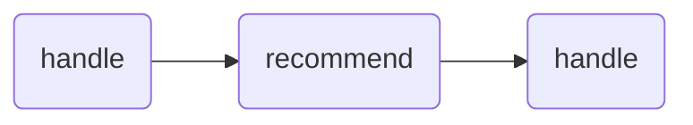

# Triển khai AOP Logging

> Bài viết này sẽ tìm hiểu sâu về cơ chế AOP trong Spring. Đồng thời áp dụng thực tế vào triển khai logging bằng AOP trong dự án.

## AOP là gì?

AOP, viết tắt của Aspect-oriented Programming, là một trong những ý tưởng thiết kế trong khoa học máy tính, mục tiêu của nó là sử dụng công nghệ khía cạnh để thêm các thông báo (Advice) bổ sung cho thực thể nghiệp vụ, từ đó quản lý và trang trí các khối mã được khai báo là "điểm cắt" (Pointcut).

Ý tưởng này rất phù hợp để thêm các chức năng không quá liên quan đến lõi của nghiệp vụ vào chương trình, giống như chủ đề của chúng ta hôm nay - chức năng ghi log, là một ví dụ điển hình.

AOP là một bổ sung cho lập trình hướng đối tượng (Object-oriented Programming, gọi tắt là OOP). Trong OOP, đơn vị cơ bản là lớp (class), trong khi trong AOP, đơn vị cơ bản là khía cạnh (Aspect). Sử dụng AOP có thể cô lập các phần của logic nghiệp vụ, giảm độ liên kết, nâng cao khả năng tái sử dụng của chương trình, đồng thời cũng tăng hiệu suất phát triển.

Chúng ta có thể đơn giản hiểu AOP là các hoạt động được thực hiện trong suốt quá trình thực thi phương thức, trước khi thực hiện, trong khi thực hiện, sau khi thực hiện, sau khi trả về giá trị, và sau khi xảy ra ngoại lệ.

## Các Thuật Ngữ Liên Quan Đến AOP

Hãy xem bức ảnh dưới đây, đây là một biểu đồ mô hình AOP, nơi thực hiện một số hoạt động chung trước và sau khi một số phương thức được thực thi và những hoạt động này không ảnh hưởng đến việc chạy của chương trình chính.


Chúng ta hãy hiểu về 5 thuật ngữ chính liên quan đến AOP:

**1) Điểm Cắt (Cross-Cutting Concerns)**: Các hoạt động cùng một loại được trích xuất từ mỗi phương thức.

**2) Khía Cạnh (Aspect)**: Là các lớp được đóng gói của điểm cắt, mỗi điểm cắt được thể hiện bằng một phương thức thông báo; thường sử dụng annotation [@Aspect](https://chat.openai.com/Aspect) để định nghĩa khía cạnh.

**3) Thông Báo (Advice)**: Công việc cụ thể mà khía cạnh phải hoàn thành, ví dụ: khía cạnh ghi log cần ghi lại thời gian trước và sau khi gọi phương thức và tính sự khác biệt thời gian giữa chúng. Có năm loại thông báo:

- @Before: Phương thức thông báo sẽ được thực hiện trước khi phương thức mục tiêu được gọi.
- @After: Phương thức thông báo sẽ được thực hiện sau khi phương thức mục tiêu được gọi.
- @AfterReturning: Phương thức thông báo sẽ được thực hiện sau khi phương thức mục tiêu trả về.
- @AfterThrowing: Phương thức thông báo sẽ được thực hiện sau khi phương thức mục tiêu ném ra ngoại lệ.
- @Around: Bao bọc toàn bộ phương thức mục tiêu và thực hiện phương thức thông báo trước và sau khi nó được gọi.  

**4) Điểm Nối (JoinPoint)**: Thời điểm mà thông báo được áp dụng, ví dụ: khi phương thức gọi được gọi là điểm nối của khía cạnh ghi log.

**5) Điểm Chạm (Pointcut)**: Phạm vi mà chức năng thông báo được áp dụng, ví dụ: phạm vi ứng dụng của khía cạnh ghi log trong bài viết này là tất cả các phương thức của controller. Thường sử dụng annotation [@Pointcut](https://chat.openai.com/Pointcut) để định nghĩa biểu thức điểm chạm.

Cú pháp biểu thức điểm chạm được quy định như sau:

```sql
execution(modifiers-pattern? ret-type-pattern declaring-type-pattern?
                name-pattern(param-pattern)
                throws-pattern?)
```

- `modifiers-pattern?`: Mẫu phương thức truy cập
- `ret-type-pattern`: Mẫu kiểu trả về, thường sử dụng `*` để biểu thị bất kỳ kiểu trả về nào.
- `declaring-type-pattern?`: Tên gói
- `name-pattern`: Tên phương thức, có thể sử dụng `*` để biểu thị tất cả hoặc `set*` để biểu thị tất cả các phương thức bắt đầu bằng set.
- `param-pattern)`: Kiểu tham số, các tham số có thể được phân cách bằng dấu `,`, mỗi tham số cũng có thể sử dụng `*` để biểu thị tất cả các kiểu tham số, cũng có thể sử dụng `(..)` để biểu thị không có hoặc bất kỳ tham số nào.
- `throws-pattern?`: Kiểu ngoại lệ
- `?`: Đánh dấu cho phần trước là tùy chọn.

Ví dụ (lấy từ lớp `com.hnv99.forum.core.mdc.MdcAspect` trong CodeForum):

```java
@Pointcut("@annotation(MdcDot) || @within(MdcDot)")
  public void getLogAnnotation() {
}

```

Ý nghĩa của điểm chạm này là: "Chặn tất cả các phương thức được đánh annotation MdcDot, cũng như tất cả các phương thức trong các lớp được đánh annotation MdcDot."

## Triển khai ghi log truy cập phương thức sử dụng AOP

Trong dự án CodeForum, việc ghi log truy cập phương thức bằng AOP được đặt trong gói `mdc` trong module `codeforum-core`, bạn có thể xem cụ thể trong mã nguồn.

Trước tiên, chúng ta hãy xem xét năm lớp sau.

### 1) SkyWalkingTraceIdGenerator

Lớp này được sao chép trực tiếp từ **SkyWalking**, một cách để tạo ra `traceId`.

[SkyWalking](https://skywalking.apache.org/) là một hệ thống giám sát hiệu suất ứng dụng mã nguồn mở, hỗ trợ theo dõi, giám sát và chẩn đoán các dịch vụ trong hệ thống phân tán.

Phương thức chính là một phương thức tĩnh generate, được sử dụng để tạo ra traceId. Tôi sẽ không dán mã nguồn lớp này ở đây, bạn có thể trực tiếp xem mã nguồn tại [code4rum](https://github.com/vanhung4499/code4rum).

TraceId được tạo ra bởi lớp này bao gồm ba phần:

- Phần đầu tiên là ID của phiên bản ứng dụng, nó là một UUID được tạo ra khi lớp được tải, và duy nhất cho mỗi tiến trình.
- Phần thứ hai là ID của luồng hiện tại.
- Phần thứ ba là một con số gồm timestamp và số thứ tự của luồng, timestamp được tính bằng mili giây, và số thứ tự của luồng là một số từ 0 đến 9999.

Phương pháp thiết kế của lớp công cụ này chủ yếu là tạo ra một traceId đồng thời độc nhất và chứa một số thông tin ngữ cảnh để giúp chúng ta theo dõi và hiểu rõ hơn về quá trình thực thi các yêu cầu trong hệ thống phân tán.

### 2) SelfTraceIdGenerator

Đây là một trình tạo traceId được tùy chỉnh, bạn có thể xem chi tiết phương thức generate dưới đây.

```java
    /**
     * <p>
     * Generates a 32-character traceId, following the rule: server IP + time when the ID is generated + auto-increment sequence + current process ID
     * IP 8 characters: 39.105.208.175 -> 2769d0af
     * Time when the ID is generated 13 characters: millisecond timestamp -> 1403169275002
     * Current process ID 5 characters: PID
     * Auto-increment sequence 4 characters: cyclic from 1000 to 9999
     * </p>
     *
     * @return ac13e001.1685348263825.095001000
     */
    public static String generate() {
        StringBuilder traceId = new StringBuilder();
        try {
            // 1. IP - 8
            traceId.append(convertIp(IpUtil.getLocalIp4Address())).append(".");
            // 2. Timestamp - 13
            traceId.append(Instant.now().toEpochMilli()).append(".");
            // 3. Current process ID - 5
            traceId.append(getProcessId());
            // 4. Auto-increment sequence - 4
            traceId.append(getAutoIncreaseNumber());
        } catch (Exception e) {
            log.error("Error generating trace id!", e);
            return UUID.randomUUID().toString().replaceAll("-", "");
        }
        return traceId.toString();
    }
```

TraceId được tạo ra bao gồm bốn phần sau:

- Địa chỉ IP (8 ký tự): Lấy địa chỉ IP hiện tại của máy và chuyển đổi nó thành định dạng hex.
- Timestamp (13 ký tự): Sử dụng lớp Instant của Java 8 để lấy timestamp hiện tại theo miliseconds.
- Số hiệu tiến trình hiện tại (5 ký tự): Sử dụng lớp ManagementFactory của Java để lấy PID của tiến trình JVM hiện tại và đảm bảo tổng độ dài là 5 ký tự.
- Số thứ tự tự tăng (4 ký tự): Một số tự tăng lặp lại từ 1000 đến 9999.

Bây giờ, chúng ta hãy so sánh traceId được tạo ra bởi SelfTraceIdGenerator (hai cái đầu tiên) và SkyWalkingTraceIdGenerator (thứ ba).

```
00000000.1686895888832.745811000
00000000.1686895888838.745811001
75e0cde204164cda98b0cca40b2999da.1.16868958889180000
```

### 3) Tại sao cần traceid?

Hãy đưa ra một ví dụ đơn giản để giải thích tại sao cần có traceid.

Khi hệ thống của bạn là một hệ thống phân tán hoặc vi dịch vụ, một yêu cầu có thể đi qua nhiều dịch vụ, mỗi dịch vụ có thể tạo ra một số lượng lớn log. Tuy nhiên, vì hệ thống là distributed/microservices, nó chạy trên các máy vật lý khác nhau. Nếu không có một định danh thống nhất để liên kết các log này, rất khó để hiểu quá trình hoàn chỉnh của một yêu cầu.

traceid chính là định danh này, nó được tạo ra khi yêu cầu nhập vào hệ thống, sau đó được truyền theo con đường thực thi của yêu cầu đến tất cả các dịch vụ tham gia xử lý yêu cầu đó. Các dịch vụ này sẽ bao gồm traceid trong log của họ. Như vậy, bằng cách tìm kiếm tất cả các log cùng một traceid, bạn có thể theo dõi quá trình thực thi của một yêu cầu.

### 4) MdcUtil

MDC là viết tắt của Mapped Diagnostic Context, có thể dịch là Bản Đồ Ngữ cảnh chẩn đoán, tuy không chắc liệu đây là chuẩn hay không, nhưng có thể hiểu đơn giản như vậy. MDC chủ yếu được sử dụng để lưu trữ thông tin chẩn đoán cụ thể cho mỗi luồng trong môi trường đa luồng, chẳng hạn như traceId.

Lớp này chủ yếu cung cấp năm phương thức:

- Phương thức add: Thêm một cặp khóa/giá trị vào MDC.
- Phương thức addTraceId: Tạo ra một traceId và thêm vào MDC.
- Phương thức getTraceId: Lấy ra traceId từ MDC.
- Phương thức reset: Xóa tất cả thông tin trong MDC, sau đó thêm lại traceId.
- Phương thức clear: Xóa tất cả thông tin trong MDC.

Nếu bạn tìm MdcUtil trong mã nguồn của codeforum, bạn sẽ tìm thấy nó trong **ReqRecordFilter**, như tên gợi ý, lớp này là một bộ lọc cho yêu cầu, sẽ thêm traceId của toàn bộ chuỗi vào mỗi yêu cầu.

Khi chạy dự án, bạn có thể tìm thấy nó trong `logs/req-dev.log`.

### 5) MdcDot

```java
@Target({ElementType.METHOD, ElementType.TYPE})
@Retention(RetentionPolicy.RUNTIME)
@Documented
public @interface MdcDot {
    String bizCode() default "";
}
```

Đoạn mã này định nghĩa một annotation @MdcDot, bạn có thể tìm thấy nó trực tiếp trong các đoạn mã sau đây.


### 6) MdcAspect

Đây là một khía cạnh AspectJ được sử dụng để triển khai lập trình hướng khía cạnh (AOP). Chúng ta đã thảo luận về chức năng của annotation [@Aspect](https://chat.openai.com/Aspect).

```java
@Aspect
public class MdcAspect implements ApplicationContextAware {}
```

Mục đích của mặt phẳng MdcAspect là xử lý các phương thức hoặc lớp được đánh dấu bằng annotation `@MdcDot`. Cụ thể cách xử lý được định nghĩa bởi phương thức handle được đánh dấu bằng annotation `@Around`.

```java
    @Pointcut("@annotation(MdcDot) || @within(MdcDot)")
        public void getLogAnnotation() {
    }

    @Around("getLogAnnotation()")
    public Object handle(ProceedingJoinPoint joinPoint) throws Throwable {
        long start = System.currentTimeMillis();
        boolean hasTag = addMdcCode(joinPoint);
        try {
            Object ans = joinPoint.proceed();
            return ans;
        } finally {
            log.info("Execution time: {}#{} = {}ms",
                    joinPoint.getSignature().getDeclaringType().getSimpleName(),
                    joinPoint.getSignature().getName(),
                    System.currentTimeMillis() - start);
            if (hasTag) {
                MdcUtil.reset();
            }
        }
    }
```

Chúng ta đã thảo luận về annotation [@Pointcut](https://chat.openai.com/Pointcut), bây giờ chúng ta sẽ xem xét phương thức handle.

Trong phương thức handle, đầu tiên, thời gian bắt đầu của việc gọi phương thức được ghi lại, sau đó kiểm tra xem có tồn tại annotation @MdcDot không và lấy mã nghiệp vụ.

```java
private boolean addMdcCode(ProceedingJoinPoint joinPoint) {
    MethodSignature signature = (MethodSignature) joinPoint.getSignature();
    Method method = signature.getMethod();
    MdcDot dot = method.getAnnotation(MdcDot.class);
    if (dot == null) {
        dot = (MdcDot) joinPoint.getSignature().getDeclaringType().getAnnotation(MdcDot.class);
    }

    if (dot != null) {
        MdcUtil.add("bizCode", loadBizCode(dot.bizCode(), joinPoint));
        return true;
    }
    return false;
}

```

Phương thức addMdcCode được sử dụng để kiểm tra xem phương thức hoặc lớp có được đánh dấu bằng annotation @MdcDot không và lấy mã nghiệp vụ, phương thức loadBizCode được sử dụng để phân tích giá trị của phần tử bizCode trong annotation @MdcDot.

```java
private String loadBizCode(String key, ProceedingJoinPoint joinPoint) {
    if (StringUtils.isBlank(key)) {
        return "";
    }

    StandardEvaluationContext context = new StandardEvaluationContext();

    context.setBeanResolver(new BeanFactoryResolver(applicationContext));
    String[] params = parameterNameDiscoverer.getParameterNames(((MethodSignature) joinPoint.getSignature()).getMethod());
    Object[] args = joinPoint.getArgs();
    for (int i = 0; i < args.length; i++) {
        context.setVariable(params[i], args[i]);
    }
    return parser.parseExpression(key).getValue(context, String.class);
}

```

Nếu tồn tại, mã nghiệp vụ được thêm vào MDC. Sau đó, gọi phương thức gốc và trả về kết quả, sau cùng ghi lại thời gian thực thi của phương thức và in log, nếu phương thức có annotation @MdcDot thì đặt lại MDC.

### 7) Cách sử dụng cụ thể?

Chúng ta đã tìm thấy annotation [@MdcDot](https://chat.openai.com/MdcDot), hãy xem phương thức recommend của **ArticleRestController**.

Đó chính là đoạn mã `@MdcDot(bizCode = "#articleId")` được thêm vào phương thức.

Okay, bây giờ chúng ta hãy xem đầu ra của bản ghi console, nội dung như sau.

```less
2024-04-15 11:06:13,008 [http-nio-8080-exec-3] INFO |00000000.1686884772947.468581113|101|c.h.forum.core.mdc.MdcAspect.handle(MdcAspect.java:47) - Method execution time: com.hnv99.forum.web.front.article.rest.ArticleRestController#recommend = 47
```

Trong đó, traceid là `00000000.1686884772947.468581113`.

Thứ tự thực thi của phương thức handle và recommend như sau.



## Tổng kết

Dưới đây là một số câu hỏi về Spring AOP bạn có thể tự trả lời:

1. **AOP là gì?**
2. **Các khái niệm cốt lõi của AOP là gì?**
3. **Có những cách nào bao bọc trong AOP?**
4. **Bạn thường sử dụng AOP như thế nào trong dự án hàng ngày?**
5. **Sự khác biệt giữa Spring AOP và AspectJ AOP là gì?**
6. **Sự khác biệt giữa JDK dynamic proxies và CGLIB proxies là gì?**
