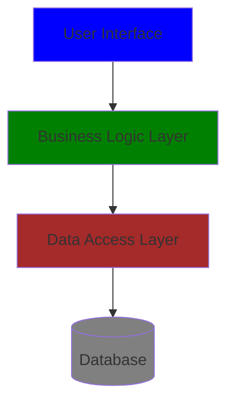
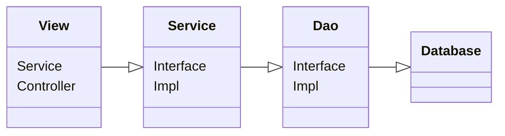

# Kiến trúc phân lớp MVC

## Kiến thức cơ bản

## Three-tier Architecture là gì?

Three-tier Architecture là một mô hình kiến trúc phần mềm phổ biến, được thiết kế để chia ứng dụng thành ba lớp logic: lớp giao diện (UI - User Interface), lớp logic nghiệp vụ (BLL - Business logic layer) và lớp truy cập dữ liệu (DAL - Data Access Layer). Sự phân chia này giúp cho việc bảo trì và mở rộng ứng dụng dễ dàng hơn.



- Lớp giao diện (UI): Được đặt ở tầng cao nhất của kiến trúc ba tầng, tiếp xúc trực tiếp với người dùng. Lớp này thực hiện chức năng giao diện người dùng, cũng như đầu vào và đầu ra dữ liệu của hệ thống, là cách truyền đạt thông tin và phản hồi cho người dùng.
- Lớp logic nghiệp vụ (BLL): Là các hoạt động xử lý cụ thể về vấn đề, cũng có thể hiểu là các hoạt động liên quan đến lớp dữ liệu, xử lý logic nghiệp vụ dữ liệu. Đồng thời, nó cũng là cầu nối giữa lớp giao diện và lớp dữ liệu, thực hiện việc kết nối dữ liệu và truyền chỉ thị giữa ba tầng.
- Lớp truy cập dữ liệu (DAL): Đôi khi cũng được gọi là tầng bền vững, chức năng chính là thao tác với dữ liệu gốc (cơ sở dữ liệu hoặc các tệp văn bản chứa dữ liệu). Cụ thể, nó thực hiện các hoạt động như thêm, xóa, sửa và truy vấn dữ liệu. Nó cung cấp dịch vụ dữ liệu cho lớp logic nghiệp vụ hoặc lớp giao diện.  

Trong thiết kế chương trình theo kiến trúc ba tầng, chúng ta sử dụng lập trình hướng đối tượng. Các tầng giao tiếp với nhau thông qua các interface, và sử dụng các lớp thực thể của mô hình đối tượng (Model) làm phương tiện truyền dữ liệu.



Kiến trúc ba tầng là một cấu trúc kết nối lỏng lẻo, sự phụ thuộc giữa các tầng là một hướng xuống dưới, các tầng trên gọi tầng dưới thông qua các interface, và các lớp thực thể của dịch vụ là phương tiện cung cấp dữ liệu thực sự. Service Interface là giống nhau, nhưng các lớp thực thể có thể thay thế, từ đó thực hiện việc phân lớp giữa các tầng.

## MVC là gì?

MVC là viết tắt của Model-View-Controller, là một mô hình thiết kế phần mềm, sắp xếp mã nguồn thành ba phần: Mô hình (Model), Giao diện (View) và Bộ điều khiển (Controller). Model tập trung logic nghiệp vụ, dữ liệu và cách tương tác với dữ liệu. View hiển thị dữ liệu cho người dùng và cập nhật thông qua dữ liệu từ người dùng. Controller xử lý sự kiện từ người dùng, tương tác với mô hình và cập nhật giao diện.

- **View**: Cung cấp giao diện người dùng để người dùng tương tác trực tiếp.
- **Model**: Đại diện cho một đối tượng hoặc POJO (Plain Old Java Object), là nơi lưu trữ và truy cập dữ liệu. Nó cũng có thể chứa logic, chủ yếu là để chứa dữ liệu và tính toán các yêu cầu từ người dùng.
- **Controller**: Xử lý yêu cầu từ người dùng bằng cách tương tác với mô hình và cập nhật giao diện.


Quy trình:

1. Người dùng tạo yêu cầu thông qua giao diện người dùng (View), có thể là yêu cầu HTML, CSS, hoặc AJAX.
2. Bộ điều khiển (Controller) của máy chủ nhận yêu cầu, phân tích nó và tìm mô hình tương ứng để xử lý yêu cầu người dùng.
3. Kết quả xử lý được chuyển lại cho Controller (Controller thực sự chỉ là cầu nối giữa View và Model).
4. Controller tìm kiếm giao diện View để trả lại phản hồi cho người dùng sau khi kết quả xử lý được render.

## Sự khác biệt giữa Kiến trúc Ba tầng và MVC

Dù là kiến trúc MVC hay kiến trúc ba tầng (Three-tier Architecture), cả hai đều là các mô hình được thiết kế dựa trên nguyên tắc "tính kết nối cao, tính phân tách cao".

MVC chủ yếu giải quyết vấn đề thay đổi giao diện ứng dụng, tách giao diện người dùng ra khỏi mã logic nghiệp vụ.

Trong khi đó, kiến trúc ba tầng tập trung vào tổ chức toàn bộ kiến trúc ứng dụng. Tất nhiên, nếu cần, cả hai kiểu kiến trúc đều có thể phân chia thành các lớp. Trong kiến trúc ba tầng, lớp logic nghiệp vụ và lớp truy cập dữ liệu phải tuân theo việc lập trình hướng đối tượng.

## Cấu trúc dự án

```shell
Comming soon
```

Dựa trên cấu trúc MVC, chúng ta có thể phân chia như sau:

- **View (View)**: codeforum-ui, giao diện người dùng.
- **Model (Model)**: codeforum-service, logic cốt lõi của backend.
- **Controller (Controller)**: codeforum-web, logic tương tác giữa UI và Backend.

Dựa trên cấu trúc ba tầng, chúng ta có thể phân chia như sau:

- **Presentation Layer (UI)**: codeforum-web, xuất dữ liệu từ backend ra frontend.
- **Business Logic Layer (BLL)**: Trong codeforum-service, ví dụ với thư mục com/codeforum/forum/service/article, service là tầng logic nghiệp vụ, bọc lại tầng DAO.
- **Layer Data Access (DAL)**: Trong codeforum-service, ví dụ với thư mục com/codeforum/forum/service/article, repository là tầng DAL, còn được gọi là tầng DAO, chịu trách nhiệm giao tiếp với DB.

## Kết luận

Khi debug code, điểm vào của code sẽ ở tầng Controller của MVC, cụ thể là codeforum-web. Trong đó, codeforum/forum/web/admin là backend của giao diện quản trị, còn các phần khác là các giao diện phía người dùng.
