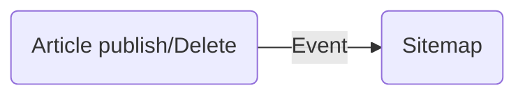

# Cơ chế và nguyên lý lắng nghe sự kiện trong Spring

Trong dự án, cơ chế lắng nghe sự kiện của Spring được sử dụng rộng rãi trong các tình huống như việc xuất bản bài viết hoặc ngừng xuất bản bài viết. Khi các sự kiện này xảy ra, một sự kiện sẽ được kích hoạt và SiteMap (bản đồ trang web) sẽ lắng nghe sự kiện này và cập nhật tương ứng.



Cơ chế lắng nghe sự kiện của Spring cơ bản là ứng dụng của [[Observer Pattern|mẫu quan sát]], bao gồm sự kiện, trình lắng nghe sự kiện và trình phát sự kiện.

- **Sự kiện (Event)**: Đại diện cho một sự kiện cụ thể trong ứng dụng, được triển khai bằng cách sử dụng lớp `ApplicationEvent`. Chúng ta có thể tạo sự kiện tùy chỉnh theo nhu cầu bằng cách kế thừa lớp `ApplicationEvent` và thêm các thuộc tính và phương thức liên quan.
    
- **Trình lắng nghe sự kiện (Event Listener)**: Triển khai các đối tượng lắng nghe sự kiện bằng cách sử dụng giao diện `ApplicationListener<E>`, trong đó E là kiểu sự kiện mà trình lắng nghe cần xử lý. Trình lắng nghe có thể xử lý sự kiện đã nhận bằng cách sử dụng phương thức `onApplicationEvent(E event)`. Ngoài ra, chúng ta cũng có thể sử dụng annotation `@EventListener` để đơn giản hóa triển khai của trình lắng nghe sự kiện, và đây chính là phương pháp mà dự án đang sử dụng.
    
- **Trình phát sự kiện (Event Publisher)**: Trách nhiệm của trình phát sự kiện là phát sự kiện cho tất cả các trình lắng nghe sự kiện quan tâm đến sự kiện đó. Trong Spring, giao diện `ApplicationEventPublisher` định nghĩa các chức năng cơ bản để phát sự kiện, và giao diện `ApplicationEventPublisherAware` cho phép các thành phần nhận tham chiếu đến trình phát sự kiện. Trong ứng dụng Spring, thường sử dụng ApplicationContext làm trình phát sự kiện trực tiếp, và đây cũng chính là phương pháp mà kỹ thuật đang sử dụng.

## Ví dụ

Bước đầu tiên, tạo sự kiện tùy chỉnh ArticleMsgEvent, kế thừa từ ApplicationEvent.

```java
@Getter
@Setter
@ToString
@EqualsAndHashCode(callSuper = true)
public class ArticleMsgEvent<T> extends ApplicationEvent {

    private ArticleEventEnum type;

    private T content;

    public ArticleMsgEvent(Object source, ArticleEventEnum type, T content) {
        super(source);
        this.type = type;
        this.content = content;
    }
}
```

Lớp trên không có gì đáng nói, bốn annotation trên lớp đều được cung cấp bởi Lombok, như đã được giải thích trong hướng dẫn trước đó.

Còn lại chỉ là hai trường, một là một enum kiểu ArticleEventEnum, đại diện cho loại sự kiện, là bài viết trực tuyến hay ngoại tuyến. Một là nội dung dạng generic, đại diện cho nội dung của sự kiện. Trong ví dụ này, chúng tôi sẽ truyền một ID của bài viết.

Trong phương thức khởi tạo còn có một source, đại diện cho nguồn gốc của sự kiện, tức là người phát hành sự kiện.

ApplicationEvent là lớp cơ sở được Spring Framework sử dụng để định nghĩa các sự kiện.

Bước thứ hai, định nghĩa lớp công cụ SpringUtil, triển khai ApplicationContextAware

```java
@Component
public class SpringUtil implements ApplicationContextAware {
    private volatile static ApplicationContext context;

    @Override
    public void setApplicationContext(ApplicationContext applicationContext) throws BeansException {
        SpringUtil.context = applicationContext;
    }

    /**
     * Phát sóng sự kiện
     *
     * @param event
     */
    public static void publishEvent(ApplicationEvent event) {
        context.publishEvent(event);
    }
}
```

Thứ ba, thực hiện việc phát sự kiện bằng cách gọi `SpringUtil.publishEvent()`. Trong lớp ArticleSettingServiceImpl.

```java
@Override
@CacheEvict(key = "'sideBar_' + #req.articleId", cacheManager = "caffeineCacheManager", cacheNames = "article")
public void updateArticle(ArticlePostReq req) {
    ArticleDO article = articleDao.getById(req.getArticleId());

    ArticleEventEnum operateEvent = null;
    if (req.getStatus() != null) {
        article.setStatus(req.getStatus());
        if (req.getStatus() == PushStatusEnum.OFFLINE.getCode()) {
            operateEvent = ArticleEventEnum.OFFLINE;
        } else if (req.getStatus() == PushStatusEnum.REVIEW.getCode()) {
            operateEvent = ArticleEventEnum.REVIEW;
        } else if (req.getStatus() == PushStatusEnum.ONLINE.getCode()) {
            operateEvent = ArticleEventEnum.ONLINE;
        }
    }
    articleDao.updateById(article);

    if (operateEvent != null) {
        // Phát sự kiện bài viết đang chờ duyệt, trực tuyến, ngoại tuyến
        SpringUtil.publishEvent(new ArticleMsgEvent<>(this, operateEvent, article.getId()));
    }
}
```

Bước thứ tư, xử lý sự kiện bằng cách sử dụng annotation `@EventListener`. Trong lớp SitemapServiceImpl, bạn có thể thấy điều này.

```java
@EventListener(ArticleMsgEvent.class)
public void autoUpdateSiteMap(ArticleMsgEvent<Long> event) {
    ArticleEventEnum type = event.getType();
    if (type == ArticleEventEnum.ONLINE) {
        addArticle(event.getContent());
    } else if (type == ArticleEventEnum.OFFLINE || type == ArticleEventEnum.DELETE) {
        rmArticle(event.getContent());
    }
}
```

Khi sự kiện loại ArticleMsgEvent được phát, phương thức này sẽ tự động kích hoạt. Trong phương thức này, trước tiên, chúng tôi lấy loại sự kiện (giá trị enum ArticleEventEnum), sau đó thực hiện các hoạt động tương ứng dựa trên loại sự kiện, thêm bài viết vào SiteMap khi được trực tuyến, xóa bài viết khỏi SiteMap khi bị ngoại tuyến hoặc xóa.

Đó chính là toàn bộ ví dụ về cơ chế lắng nghe sự kiện của Spring trong dự án.

## Phân tích nguyên lý

Cơ chế lắng nghe sự kiện trong Spring liên quan đến bốn lớp chính:

- ApplicationEvent: Đối tượng sự kiện
- ApplicationListener: Trình lắng nghe sự kiện, có thể xác định phương thức xử lý sự kiện bằng chú thích `@EventListener`, không cần phải triển khai giao diện ApplicationListener.
- ApplicationEventMulticaster: Bộ quản lý sự kiện, quản lý trình lắng nghe và phát sự kiện, thường được triển khai bằng lớp SimpleApplicationEventMulticaster. Nó sẽ duyệt qua tất cả các trình lắng nghe đã đăng ký và gọi phương thức `onApplicationEvent()` của chúng.
- ApplicationEventPublisher: Người phát sự kiện, trong Spring, bạn có thể phát sự kiện bằng cách triển khai giao diện ApplicationEventPublisherAware hoặc sử dụng chú thích `@Autowired` để tiêm vào một phiên bản của ApplicationEventPublisher. Khi sự kiện được phát, Spring sẽ tự động gọi phương thức `onApplicationEvent()` của các lớp triển khai ApplicationListener đã đăng ký.

### ApplicationEvent

ApplicationEvent kế thừa từ đối tượng EventObject.

```java
public abstract class ApplicationEvent extends EventObject {
    private static final long serialVersionUID = 7099057708183571937L;
    private final long timestamp; // thêm một thuộc tính thời gian đánh dấu thời gian
    public ApplicationEvent(Object source) {
        super(source);
        this.timestamp = System.currentTimeMillis(); // khởi tạo thời gian đánh dấu là thời gian hiện tại
    }
    public final long getTimestamp() {
        return this.timestamp;
    }
}
```

Hãy xem biểu đồ con của lớp ApplicationEvent.


ApplicationEvent có một lớp con quan trọng là ApplicationContextEvent, và ApplicationContextEvent có 4 lớp con quan trọng:

- ContextStartedEvent: Sự kiện này được kích hoạt khi Spring Container được khởi động. Điều này có nghĩa là tất cả các Bean đã được tải và ApplicationContext đã được khởi tạo.
- ContextStoppedEvent: Sự kiện này được kích hoạt khi Spring Container được dừng. Thường xảy ra khi container đóng và dừng xử lý yêu cầu.
- ContextRefreshedEvent: Sự kiện này được kích hoạt khi ApplicationContext được làm mới. Điều này chỉ ra rằng tất cả các Bean đã được tạo và tất cả các Bean Singleton đã được khởi tạo (nếu chúng cần được khởi tạo khi container được khởi tạo).
- ContextClosedEvent: Sự kiện này được kích hoạt khi Spring Container được đóng. Điều này chỉ ra rằng tất cả các Bean đã bị hủy và Spring Container đã dọn dẹp tài nguyên và dừng hoạt động.

### ApplicationListener

ApplicationListener kế thừa giao diện EventListener và yêu cầu triển khai phương thức `onApplicationEvent(E event)`.

```java
@FunctionalInterface
public interface ApplicationListener<E extends ApplicationEvent> extends EventListener {

    /**
     * Xử lý một sự kiện ứng dụng.
     * @param event sự kiện để phản hồi
     */
    void onApplicationEvent(E event);

}
```

Phương thức `onApplicationEvent(E event)`: Khi một sự kiện được phát, tất cả các phiên bản đã đăng ký của ApplicationListener sẽ được gọi. Trong phương thức này, bạn có thể viết mã để xử lý logic của sự kiện cụ thể. Phương thức này nhận một tham số kiểu E, đây là một lớp con của ApplicationEvent, đại diện cho sự kiện đã được kích hoạt.

Khi ứng dụng Spring được khởi động, Spring sẽ quét tất cả các Bean để tìm các phương thức sử dụng chú thích `@EventListener`. Khi tìm thấy các phương thức này, Spring sẽ tạo các phiên bản của ApplicationListener và đăng ký chúng vào ApplicationEventMulticaster.

### ApplicationEventMulticaster

ApplicationEventMulticaster là một interface, chịu trách nhiệm quản lý trình lắng nghe và phát sự kiện, bao gồm các phương thức để đăng ký trình lắng nghe, gỡ bỏ trình lắng nghe và phát sự kiện.

Spring container thường có một triển khai mặc định, như SimpleApplicationEventMulticaster, kế thừa từ AbstractApplicationEventMulticaster.

AbstractApplicationEventMulticaster chủ yếu triển khai các phương thức quản lý trình lắng nghe (5 phương thức đầu tiên của interface), như addApplicationListener.

```java
@Override
public void addApplicationListener(ApplicationListener<?> listener) {
    synchronized (this.defaultRetriever) {
        // Xóa rõ ràng mục tiêu cho một proxy, nếu đã đăng ký,
        // để tránh gọi hai lần cùng một trình lắng nghe.
        Object singletonTarget = AopProxyUtils.getSingletonTarget(listener);
        if (singletonTarget instanceof ApplicationListener) {
            this.defaultRetriever.applicationListeners.remove(singletonTarget);
        }
        this.defaultRetriever.applicationListeners.add(listener);
        this.retrieverCache.clear();
    }
}

```

Dòng mã quan trọng nhất là: `this.defaultRetriever.applicationListeners.add(listener);`, trong đó, DefaultListenerRetriever là một lớp nội bộ có hai tập hợp, được sử dụng để quản lý trình lắng nghe sự kiện.

Điều này tương tự như mô hình Publisher-Subscriber trong thiết kế phần mềm. Nó duy trì một danh sách, quản lý tất cả các người đăng ký, và khi người phát sự kiện phát đi thông điệp, nó duyệt qua danh sách người đăng ký tương ứng, thực thi callback handler của mỗi người đăng ký.

Tiếp theo, xem xét cách SimpleApplicationEventMulticaster triển khai logic phát sóng sự kiện:

Phương thức multicastEvent chủ yếu có nhiệm vụ phát sóng sự kiện ApplicationEvent đã cho tất cả các trình lắng nghe tương ứng.

- Đầu tiên, kiểm tra xem tham số eventType có null không để xác định loại sự kiện. Nếu eventType là null, sẽ sử dụng phương thức `resolveDefaultEventType(event)` để giải mã loại sự kiện từ chính đối tượng sự kiện.
- Lấy Executor, một Executor tùy chọn được sử dụng để gọi trình lắng nghe một cách bất đồng bộ. Nếu không có Executor được cấu hình, giá trị mặc định là null, chỉ định việc thực hiện đồng bộ.
- Sử dụng phương thức `getApplicationListeners(event, type)` để lấy tất cả các trình lắng nghe khớp với loại sự kiện đã cho.
- Đối với mỗi trình lắng nghe khớp, kiểm tra xem Executor có được cấu hình không. Nếu có, sử dụng phương thức `executor.execute()` để đóng gói cuộc gọi của trình lắng nghe vào một nhiệm vụ bất đồng bộ. Nếu không có Executor, gọi trực tiếp trình lắng nghe một cách đồng bộ.
- Sử dụng phương thức `invokeListener(listener, event)` để gọi phương thức `onApplicationEvent` của trình lắng nghe và chuyển sự kiện cho trình lắng nghe.

Thông qua cơ chế này, SimpleApplicationEventMulticaster có thể phát sóng sự kiện cho tất cả các trình lắng nghe quan tâm đến sự kiện, đồng thời hỗ trợ cả chế độ đồng bộ và bất đồng bộ.

### ApplicationEventPublisher

ApplicationEventPublisher là một interface, được sử dụng để phát sự kiện cho tất cả các trình lắng nghe quan tâm.

Thường thì các lớp hiện thực của interface này sẽ chuyển giao sự kiện cho ApplicationEventMulticaster. Trong Spring, ApplicationContext thường đóng vai trò của người phát sự kiện và hiện thực interface ApplicationEventPublisher.

Phương thức publishEvent của ApplicationContext được triển khai chính trong lớp AbstractApplicationContext:

Phần mã quan trọng của đoạn mã này là:

```java
if (this.earlyApplicationEvents != null) {
    this.earlyApplicationEvents.add(applicationEvent);
} else {
    getApplicationEventMulticaster().multicastEvent(applicationEvent, eventType);
}

```

Mã này xử lý việc phát sự kiện của ứng dụng khi ApplicationContext được khởi tạo. Khi ApplicationContext chưa hoàn toàn khởi tạo, ví dụ như trong phương thức `refresh()`, danh sách earlyApplicationEvents sẽ được sử dụng để lưu trữ các sự kiện sớm. Trong giai đoạn này, ApplicationEventMulticaster vẫn chưa được cấu hình hoàn chỉnh, do đó không thể phát sự kiện trực tiếp. Các sự kiện sớm này sẽ được phát hành sau khi ApplicationContext được khởi tạo hoàn chỉnh, và ApplicationEventMulticaster được cấu hình, thông qua phương thức `finishRefresh()` và `publishEvent(new ContextRefreshedEvent(this));`.

Khi ApplicationContext được khởi tạo hoàn chỉnh, danh sách earlyApplicationEvents sẽ được đặt thành null. Lúc này, sự kiện có thể được phát trực tiếp thông qua phương thức `getApplicationEventMulticaster().multicastEvent(applicationEvent, eventType)` và gửi đến tất cả các trình lắng nghe tương ứng.

Cơ chế này đảm bảo rằng các sự kiện được tạo ra trong quá trình khởi tạo của ApplicationContext không bị mất mát mà được phát hành đúng cách sau khi ApplicationContext được khởi tạo hoàn chỉnh.

## Tổng kết

Bài viết này đã giải thích rất tốt về cơ chế lắng nghe sự kiện trong Spring cũng như nguyên tắc hoạt động phía sau thông qua mã nguồn, nhấn mạnh vào việc định nghĩa đối tượng sự kiện, cách triển khai trình lắng nghe và cách hoạt động của bộ điều khiển sự kiện
