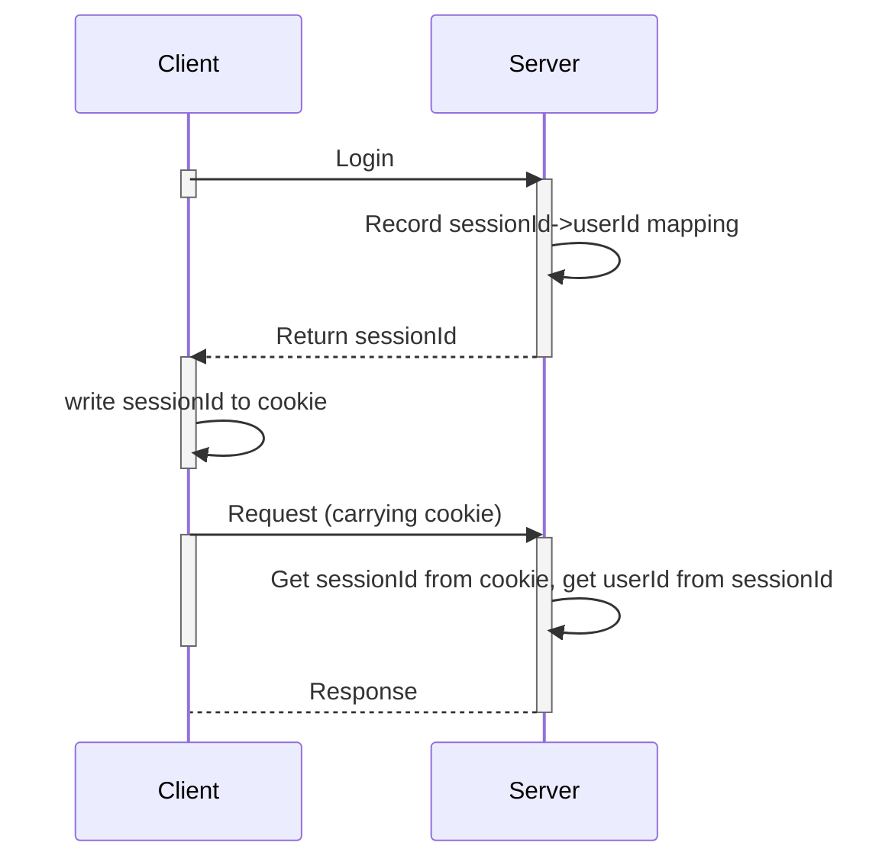
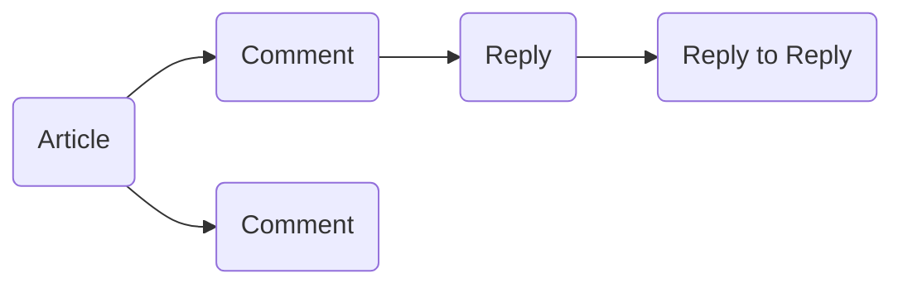

# Thiết kế giải pháp kĩ thuật

## Giới thiệu chung

### Giới thiệu module hệ thống

#### Cấu trúc hệ thống

Dựa vào đặc điểm phân lớp của hệ thống cộng đồng, toàn bộ kiến trúc hệ thống được chia thành Presentation Layer (tầng trình diễn), Application Layer (tầng ứng dụng), Service Layer (tầng dịch vụ), Infrastructure Layer (hạ tầng)


#### Presentation Layer

Tầng trình diễn chủ yếu là nơi mà người dùng tương tác trực tiếp với hệ thống. Dựa trên vai trò của người dùng mà chia thành web ứng dụng cho người dùng thường và web quản lý cho admin.

##### Frontend Web

- Sử dụng Template Engine Thymleafflowchart TD  
Start --> Stop

- Do cá nhân tôi không mạnh về frontend, nên sử dụng Thymleaf nhằm giảm thời gian phát triển frontend.

##### Admin Web

- Triển khai CSR (Client Side Rendering) tách biệt frontend backend
- Sử dụng ReactJS để xây dựng giao diện người dùng

#### Application Layer

Tầng ứng dụng, còn có thể gọi là tầng nghiệp vụ, có liên quan chặt chẽ tới các hoạt động nghiệp vụ. Mỗi module được phân chia ranh giới nghiệp vụ rõ ràng.

Mặc dù theo hình trên, frontend và backend được phân chia rõ ràng nhưng backend cũng có các chức năng nghiệp vụ như bài viết, bình luận, người dùng. Sự khác biệt chính ở giữa frontend và backend ở đây là phân quyền. Đối với hệ thống, các ứng dụng có thể được chia thành:

- Article
- Column
- Comment
- User
- Favorite (có thể hiểu là bookmark)
- Follow
- Operations
- Review
- Tag Management
- Statistcs

#### Service Layer

Tôi thiết kế một số module chắc năng chung có thể tách khỏi thuộc tính nghiệp vụ thành tầng dịch vụ và thiết kế chúng thành các dịch vụ cơ bản như Count Service (dịch vụ đếm), Message Service (dịch vụ tin nhắn), … Thông thường đặc điểm lớn nhất của chúng là độc lập với nghiệp vụ và có khả năng mở rộng hơn, không giới hạn ở các lĩnh vực nghiệp vụ cụ thể và có thể tồn tại như một giải pháp kĩ thuật tổng thể, có thể tái sử dụng.

Trong thiết kế dự án kĩ thuật, tôi phát triển các dịch vụ cơ bản sau:

- Quản lý xác thực/phân quyền (Auth)
- Trung tâm tin nhắn (MQ - MessageQueue)
- Counting (Redis)
- Tìm kiếm (ElasticSearch)
- Gợi ý
- Giám sát vận hành bảo trì (Prometheus)

#### Infrastructure Layer

Tầng bao gồm các cơ sở hạ tầng hỗ trợ sau cùng:

- Tài nguyên dịch vụ: database, redis, es, mq
- Tài nguyên phần cứng: container, ecs server

### Giới thiệu thuật ngữ

Trong dự án không có nhiều thuật ngữ, đây là một số thuật ngữ thường dùng:

- User: đề cập đến cụ thể người dùng thông thường, đăng ký tài khoản và có thể xuất bản hoặc đọc bài viết, …
- Admin: người dùng đặc biệt, quyền hạn cao, có thể đăng nhập admin web
- Article: bài viết được đăng trên cộng đồng
- Column: tập hợp các bài viết có liên quan (vd như 1 cùng 1 chủ đề về mysql)

### Kiến trúc hệ thống

comming soon!

## Thiết kế module hệ thống

 Theo cách chia theo kiến trúc nghiệp vụ trên, việc chia dự án chủ yếu là 5 module. Ngược lại mỗi ứng dụng và dịch vụ trên trên sẽ không được tách thành các module độc lập, chủ yếu là tránh thiết quá phức tạp và chi tiết. Việc phân chia quá sâu sẽ là tăng chi phí tìm hiểu và bảo trì của toàn bộ dự án.

Năm module tương đối độc lập được thiết lập ở đây chủ yếu dựa trên góc nhìn nghiệp vụ. Khi triển khai microservice sau này, mỗi module sẽ có thể triển khai dưới dạng một service độc lập.

### User Module

User module có thể được chia thành:

- Đăng ký, đăng nhập (Authentication)
- Quản lý phân quyền (Authorization, quản lý quyền cũng được xử lý ở đây)
- Business Logic

#### Authentication

##### Thiết kế

 Ngoài phương thức đăng nhập bằng username + password (credentials) truyền thống, còn có phương thức xác thực được uỷ quyền từ bên thứ ba (Google, Github).

##### Thiết kế bảng dữ liệu

Dựa trên phương thức đăng nhập, bảng user được thiết kế như sau:

```sql
CREATE TABLE `user` (  
  `id` int(10) unsigned NOT NULL AUTO_INCREMENT COMMENT 'User ID',  
  `3rd_party_id` varchar(255) NOT NULL COMMENT '3rd Party ID',  
  `3rd_party_username` varchar(255) NOT NULL COMMENT '3rd Party Username',  
  `login_type` tinyint(4) NOT NULL COMMENT 'Login Type: 0-Credential, 1-3rd Party',  
  `username` varchar(255) NOT NULL COMMENT 'Username',  
  `password` varchar(255) NOT NULL COMMENT 'Password',  
  `email` varchar(255) NOT NULL COMMENT 'Email',  
  `deleted` tinyint(4) NOT NULL DEFAULT '0' COMMENT 'Soft Delete: 0-Not Deleted, 1-Deleted',  
  `created_time` datetime NOT NULL DEFAULT CURRENT_TIMESTAMP COMMENT 'Created Time  
  `updated_time` datetime NOT NULL DEFAULT CURRENT_TIMESTAMP ON UPDATE CURRENT_TIMESTAMP COMMENT 'Updated Time',  
  PRIMARY KEY (`id`),  
  KEY `key_3rd_party_id` (`3rd_party_id`),  
   KEY `key_username` (`username`),  
) ENGINE=InnoDB AUTO_INCREMENT=1 DEFAULT CHARSET=utf8mb4 COMMENT='User Table';
```

Hai trường `username` và `password` là phương thức chính để đăng nhập, `3rd_party_id` là trường lưu id dữ liệu xác thực từ bên thứ ba.

#### Authorization

Quản lý phân quyền được chia thành: nhận dạng và xác thực người dùng

##### Thiết Kế

**Nhận dạng người dùng**

Có nhiều giải pháp để nhận dạng, tôi triển khai phương pháp cơ bản và lâu đời nhất là phương pháp cookie + session (nó sẽ được tối ưu lại thành phân phối session + jwt sau này)

Quy trình tổng thể:

- User (Client) đăng nhập thành công và Server tạo ánh xạ `sessionId -> userId`
- Server trả về `sessionId` và ghi nó vào `cookie` trình duyệt của Client
- Các request tiếp theo của user mang theo `cookie`
- Server lấy `sessionId` từ cookie và tìm `userId`



Dịch vụ cung cấp nhận dạng nội bộ:

Một điểm cần được quan tâm là danh tính của người dùng được truyền khắp hệ thống như thế nào? Đối với kiến trúc đơn mà tôi áp dụng trong giai đoạn đầu, tôi sử dụng ThreadLocal để triển khai

- Tuỳ chỉnh Filter để nhận dạng người dùng (nghĩa là trong quy trình trên, lấy sessionId từ cookie chuyển thành userId để sử dụng)
- Xác định ngữ cảnh toàn cầu ReqInfoContext: ghi thông tin người dùng vào ThreadLocal được chia sẻ toàn cầu
- Trong hệ thống khi bạn cần lấy thông tin người dùng hiện tại (current user), bạn có thể lấy trực tiếp bằng cách truy cập ngữ cảnh ReqInfoContext.
- Trước khi trả về phản hồi (response), huỷ thông tin người dùng hiện tại trong ngữ cảnh.

**Xác thực**

Dựa trên vai trò của người dùng và yêu cầu về giao diện, tôi sẽ tạo ra ba điểm cấp phép:

- **ADMIN**: Các phương thức mà chỉ admin mới có thể truy cập
- **LOGIN**: Các phương thức cần phải đăng nhâp mới có thể truy cập
- **ALL**: Mặc định, không bị hạn chế quyền truy cập

Tôi sẽ tạo các yêu cầu về quyền tương ứng vào các interface yêu cầu xác định quyền, sau đó sử dụng AOP để triển khai xác định quyền.

- Khi có yêu cầu về điểm cấp phép trên interface (trừ ALL)
- Trước tiên hãy lấy thông tin người dùng, nếu bạn chưa đăng nhập, trực tiếp trả về 403
- Đối với các phương thức bị hạn chế bở ADMIN thì bắt buộc phải là admin mới được truy cập.

##### Thiết Kế Bảng dữ liệu

Thông tin `role` của user được ghi trực tiếp vào bảng `user_info` thay thì tạo bảng riêng để ánh xạ nó. Điều này chủ yếu do logic hệ thống tương đối rõ ràng và không có mối quan hệ vai trò phức tạp nên áp dụng thiết kế gọn nhẹ!

```sql
CREATE TABLE `user_info` (  
  `id` int(10) NOT NULL AUTO_INCREMENT COMMENT 'User Info ID',  
  `user_id` int(10) NOT NULL COMMENT 'User ID',  
  `first_name` varchar(50) NOT NULL COMMENT 'First Name',  
  `last_name` varchar(50) NOT NULL COMMENT 'Last Name',  
  `photo` varchar(255) NOT NULL COMMENT 'Photo',  
  `position` varchar(50) NOT NULL COMMENT 'Position',  
  `profile` varchar(255) NOT NULL COMMENT 'Profile',  
  `company` varchar(255) NOT NULL COMMENT 'Company',  
  `user_role` tinyint(4) NOT NULL COMMENT 'User Role: 0-User, 1-Admin',  
  `extend` varchar(255) NOT NULL COMMENT 'Extend',  
  `ip` json NOT NULL COMMENT 'User IP information',  
  `gender` tinyint(4) NOT NULL  
  `deleted` tinyint(4) NOT NULL DEFAULT '0' COMMENT 'Soft Delete: 0-Not Deleted, 1-Deleted',  
  `created_time` datetime NOT NULL DEFAULT CURRENT_TIMESTAMP COMMENT 'Created Time',  
  `updated_time` datetime NOT NULL DEFAULT CURRENT_TIMESTAMP ON UPDATE CURRENT_TIMESTAMP COMMENT 'Updated Time',  
  PRIMARY KEY (`id`),  
  KEY `key_user_id` (`user_id`),  
) ENGINE=InnoDB AUTO_INCREMENT=1 DEFAULT CHARSET=utf8mb4 COMMENT='User Info Table';
```

#### Business Logic

Trong business module, có hai phần chính, một là phần lịch sử của người dùng và đăng ký theo dõi

##### Đăng ký theo dõi

Giống như việc subcribe một kênh youtube, người dùng dùng đăng kí để theo dõi lẫn nhau. ĐIểm cốt lõi là duy trì mối quah hệ theo dõi giữa những người dùng.

Về business logic không có gì quá phức tập, cốt lõi là cần có một bảng để ghi lại các hoạt động theo dõi.

```sql
CREATE TABLE `user_relation` (  
  `id` int(10) unsigned NOT NULL AUTO_INCREMENT COMMENT 'User Relation ID',  
  `user_id` int(10) unsigned NOT NULL DEFAULT '0' COMMENT 'User ID',  
  `follow_user_id` int(10) unsigned NOT NULL DEFAULT '0' COMMENT 'Follow User ID',  
  `follow_state` tinyint(2) NOT NULL DEFAULT '0' COMMENT 'Follow State: 0-Not Follow, 1-Follow, 2: Unfollowed',  
  `created_time` datetime NOT NULL DEFAULT CURRENT_TIMESTAMP COMMENT 'Created Time',  
  `updated_time` datetime NOT NULL DEFAULT CURRENT_TIMESTAMP ON UPDATE CURRENT_TIMESTAMP COMMENT 'Updated Time',  
  PRIMARY KEY (`id`),  
  UNIQUE KEY `uk_user_follow` (`user_id`,`follow_user_id`),  
  KEY `key_user_id` (`user_id`),  
  KEY `key_follow_user_id` (`follow_user_id`),  
) ENGINE=InnoDB AUTO_INCREMENT=1 DEFAULT CHARSET=utf8mb4 COMMENT='User Relation Table';
```

##### Lịch sử người dùng

Trong thiết kế tổng thể của dự án, tôi muốn ghi lại hành vi của người dùng bao gồm lịch sử đọc, danh sách theo dõi, danh sách yêu thích và cả những đánh giá vào bài viết của người dùng. Đối với loại lịch sử hành vi người dùng này, tôi thết kế một bảng lớn, mục đích để:

- Ghi lại các hoạt động chính của người dùng
- Tạo điều kiện đếm các bài viết có liên quan  
Hãy xem thiết kê cấu trúc bảng:

```sql
CREATE TABLE `user_foot` (  
  `id` int(10) unsigned NOT NULL AUTO_INCREMENT COMMENT 'User Foot ID',  
  `user_id` int(10) unsigned NOT NULL DEFAULT '0' COMMENT 'User ID',  
  `document_id` int(10) unsigned NOT NULL DEFAULT '0' COMMENT 'Document ID',  
  `document_type` tinyint(4) NOT NULL DEFAULT '1' COMMENT 'Document Type: 1-Article, 2-Comment',  
  `document_user_id` int(10) unsigned NOT NULL DEFAULT '0' COMMENT 'User ID of Document',  
  `collection_stat` tinyint(3) unsigned NOT NULL DEFAULT '0' COMMENT 'Collection Stat: 0-Not Collection, 1-Collection, 2-Deleted',  
  `read_stat` tinyint(3) unsigned NOT NULL DEFAULT '0' COMMENT 'Read Stat: 0-Not Read, 1-Road',  
  `comment_stat` tinyint(3) unsigned NOT NULL DEFAULT '0' COMMENT 'Comment Stat: 0-Not Comment, 1-Comment, 2-Deleted',  
  `praise_stat` tinyint(3) unsigned NOT NULL DEFAULT '0' COMMENT 'Praise Stat: 0-Not Praise, 1-Praise, 2-Deleted',  
  `created_time` datetime NOT NULL DEFAULT CURRENT_TIMESTAMP COMMENT 'Created Time',  
  PRIMARY KEY (`id`),  
  UNIQUE KEY `key_user_document` (`user_id`, `document_id`, `document_type`),  
  KEY `idx_document_id` (`document_id`),  
) ENGINE=InnoDB AUTO_INCREMENT=1 DEFAULT CHARSET=utf8mb4 COMMENT='User Foot Table';
```

Tôi thiết kế một khoá duy nhất của người dùng + bài viết để ghi lại hành vi của người dùng đối với các bài viết họ đã đọc, nhờ đó tôi có thể trực tiếp lấy được lịch sử của người dùng thông qua bảng này.

Đồng thời, dưới góc độ bài viết, tôi cũng có thể kiểm tra xem ai đã thích và đánh dấu!

### Article Module

Tôi gộp Article và Column lại với nhau, đồng thơi thêm quản lý category, tag, … và module này. Trên thực tế module này sẽ rất lớn, nó có thể được chia nhỏ hơn theo cách phân chia ban đầu, nhưng lý do chính để đặt chúng chung với nhau là chúng đều xoay quanh thuộc tính nghiệp vụ của các bài viết cơ bản và có thể được tổng hợp lại với nhau.

#### Article

Cốt lõi của bài viết nằm ở xuất bản và xem.

Quy trình xuất bản cơ bản:

1. Người dùng đăng nhập và vào trang phát hành
2. Nhập tiêu đề và bài viết
3. Chọn danh mục, thẻ, bìa, giới thiệu
4. Gửi bài viết và chờ xét duyệt. Chỉ người viết mới có thể xem chi tiết.
5. Sau khi được quản trị viên phê duyệt, mọi người đều có thể xem.

#### Thiết kế bảng article

Xét thấy nội dung bài viết thường lớn nên trong nhiều tình huống nghiệp vụ, chúng ta thật sự không nội dung của bài viết như trang chủ, danh sách đề xuất, … chỉ cần tiêu đề bài viết và các thông tin khác. Tôi muốn sẽ tạo ra chức năng quản lý phiên bản (vd: sau khi đăng lên, nếu sửa đổi sẽ tạo ra phiên bản mới, trong trường hợp muốn rollback có thể quay lại)  
Vì vậy thiết kế hai bảng cho article như sau:

```sql

CREATE TABLE `article` (  
    `id` int(10) unsigned NOT NULL AUTO_INCREMENT COMMENT 'Article ID',  
    `user_id` int(10) unsigned NOT NULL DEFAULT '0' COMMENT 'User ID',  
    `article_type` tinyint(4) NOT NULL DEFAULT '1' COMMENT 'Article Type: 1-Article, 2-Question',  
    `title` varchar(120) NOT NULL DEFAULT '' COMMENT 'Title',  
    `short_title` varchar(120) NOT NULL DEFAULT '' COMMENT 'Short Title',  
    `picture` varchar(128) NOT NULL DEFAULT '' COMMENT 'Picture',  
    `summary` varchar(300) NOT NULL DEFAULT '' COMMENT 'Summary',  
    `category_id` int(10) unsigned NOT NULL DEFAULT '0' COMMENT 'Category ID',  
    `source` tinyint(4) NOT NULL DEFAULT '1' COMMENT 'Source: 1-Repost, 2-Original, 3-Translation',  
    `source_url` varchar(128) NOT NULL DEFAULT '' COMMENT 'Source URL',  
    `official_stat` int(10) unsigned NOT NULL DEFAULT '0' COMMENT 'Official Stat: 0-Not Official, 1-Official',  
    `topping_stat` int(10) unsigned NOT NULL DEFAULT '0' COMMENT 'Topping Stat: 0-Not pinned, 1-Head Page Pinned',  
    `cream_stat` int(10) unsigned NOT NULL DEFAULT '0' COMMENT 'Cream Stat: 0-Not Cream, 1-Cream',  
    `status` tinyint(4) NOT NULL DEFAULT '0' COMMENT 'Status: 0-Not Published, 1-Published',  
    `deleted` tinyint(4) NOT NULL DEFAULT '0' COMMENT 'Soft Delete: 0-Not Deleted, 1-Deleted',  
    `created_time` datetime NOT NULL DEFAULT CURRENT_TIMESTAMP COMMENT 'Created Time',  
    `updated_time` datetime NOT NULL DEFAULT CURRENT_TIMESTAMP ON UPDATE CURRENT_TIMESTAMP COMMENT 'Updated Time',  
    PRIMARY KEY (`id`),  
    KEY `idx_category_id` (`category_id`),  
    KEY `idx_title` (`title`),  
    KEY `idx_short_title` (`short_title`),  
) ENGINE=InnoDB AUTO_INCREMENT=173 DEFAULT CHARSET=utf8mb4 COMMENT='Article Table';  
  
CREATE TABLE `article_detail` (  
    `id` int(10) unsigned NOT NULL AUTO_INCREMENT COMMENT 'Article Detail ID',  
    `article_id` int(10) unsigned NOT NULL DEFAULT '0' COMMENT 'Article ID',  
    `version` int(10) unsigned NOT NULL DEFAULT '0' COMMENT 'Version',  
    `content` longtext COMMENT 'Content',  
    `deleted` tinyint(4) NOT NULL DEFAULT '0' COMMENT 'Soft Delete: 0-Not Deleted, 1-Deleted',  
    `created_time` datetime NOT NULL DEFAULT CURRENT_TIMESTAMP COMMENT 'Created Time',  
    `updated_time` datetime NOT NULL DEFAULT CURRENT_TIMESTAMP ON UPDATE CURRENT_TIMESTAMP COMMENT 'Updated Time',  
    PRIMARY KEY (`id`),  
    UNIQUE KEY `idx_article_version` (`article_id`, `version`),  
) ENGINE=InnoDB AUTO_INCREMENT=141 DEFAULT CHARSET=utf8mb4 COMMENT='Article Detail Table';
```

Danh mục tương ứng với bài viết. Tôi đặt ra một bài viết chỉ có thể được liệt kê trong một danh mục.

```sql
CREATE TABLE `category` (  
    `id` int(10) unsigned NOT NULL AUTO_INCREMENT COMMENT 'Category ID',  
    `category_name` varchar(50) NOT NULL DEFAULT '' COMMENT 'Category Name',  
    `status` tinyint(4) NOT NULL DEFAULT '0' COMMENT 'Status: 0-Not Published, 1-Published',  
    `rank` tinyint(4) NOT NULL DEFAULT '0' COMMENT 'Rank',  
    `deleted` tinyint(4) NOT NULL DEFAULT '0' COMMENT 'Soft Delete: 0-Not Deleted, 1-Deleted',  
    `created_time` datetime NOT NULL DEFAULT CURRENT_TIMESTAMP COMMENT 'Created Time',  
    `updated_time` datetime NOT NULL DEFAULT CURRENT_TIMESTAMP ON UPDATE CURRENT_TIMESTAMP COMMENT 'Updated Time',  
    PRIMARY KEY (`id`),  
) ENGINE=InnoDB AUTO_INCREMENT=10 DEFAULT CHARSET=utf8mb4 COMMENT='Category Table';
```

Thuộc tính tag tương ứng với bài viết, một bài viết có thể có nhiều tag:

```sql
CREATE TABLE `tag` (  
    `id` int(10) unsigned NOT NULL AUTO_INCREMENT COMMENT 'Tag ID',  
    `tag_name` varchar(120) NOT NULL DEFAULT '' COMMENT 'Tag Name',  
    `tag_type` tinyint(4) NOT NULL DEFAULT '1' COMMENT 'Tag Type: 1-System Tag, 2-Custom Tag',  
    `category_id` int(10) unsigned NOT NULL DEFAULT '0' COMMENT 'Category ID',  
    `status` tinyint(4) NOT NULL DEFAULT '0' COMMENT 'Status: 0-Not Published, 1-Published',  
    `deleted` tinyint(4) NOT NULL DEFAULT '0' COMMENT 'Soft Delete: 0-Not Deleted, 1-Deleted',  
    `created_time` datetime NOT NULL DEFAULT CURRENT_TIMESTAMP COMMENT 'Created Time',  
    `updated_time` datetime NOT NULL DEFAULT CURRENT_TIMESTAMP ON UPDATE CURRENT_TIMESTAMP COMMENT 'Updated Time',  
    PRIMARY KEY (`id`),  
    KEY `idx_category_id` (`category_id`),  
) ENGINE=InnoDB AUTO_INCREMENT=147 DEFAULT CHARSET=utf8mb4 COMMENT='Tag Table';  
  
CREATE TABLE `article_tag` (  
    `id` int(10) unsigned NOT NULL AUTO_INCREMENT COMMENT 'Article Tag ID',  
    `article_id` int(10) unsigned NOT NULL DEFAULT '0' COMMENT 'Article ID',  
    `tag_id` int(10) unsigned NOT NULL DEFAULT '0' COMMENT 'Tag ID',  
    `deleted` tinyint(4) NOT NULL DEFAULT '0' COMMENT 'Soft Delete: 0-Not Deleted, 1-Deleted',  
    `created_time` datetime NOT NULL DEFAULT CURRENT_TIMESTAMP COMMENT 'Created Time',  
    `updated_time` datetime NOT NULL DEFAULT CURRENT_TIMESTAMP ON UPDATE CURRENT_TIMESTAMP COMMENT 'Updated Time',  
    PRIMARY KEY (`id`),  
    UNIQUE KEY `idx_article_tag` (`article_id`, `tag_id`),  
) ENGINE=InnoDB AUTO_INCREMENT=145 DEFAULT CHARSET=utf8mb4 COMMENT='Article Tag Table';
```

#### Column

Column chủ yếu là tập hợp một loạt bài viết, dựa trên đó, giải pháp thiết kế đơn giản nhất là thêm bảng `Column` sau đó thêm bảng ánh xạ giữa `Column` và `Article`.

Tuy nhiên, thứ tự các bài viết trong column có thể điều chỉnh được.

#### Thiết kế bảng Column

Bảng Column

```sql
CREATE TABLE `column_info` (  
    `id` int(10) unsigned NOT NULL AUTO_INCREMENT COMMENT 'Column Info ID',  
    `column_name` varchar(50) NOT NULL DEFAULT '' COMMENT 'Column Name',  
    `user_id` int(10) unsigned NOT NULL DEFAULT '0' COMMENT 'User ID',  
    `introduction` varchar(255) NOT NULL DEFAULT '' COMMENT 'Introduction',  
    `cover` varchar(128) NOT NULL DEFAULT '' COMMENT 'Cover',  
    `state` tinyint(3) unsigned NOT NULL DEFAULT '0' COMMENT 'State: 0-Waiting, 1-Continue, 2-Finished',  
    `publish_time` datetime NOT NULL DEFAULT '1970-01-02 00:00:00'` COMMENT 'Publish Time',  
    `created_time` datetime NOT NULL DEFAULT CURRENT_TIMESTAMP COMMENT 'Created Time',  
    `updated_time` datetime NOT NULL DEFAULT CURRENT_TIMESTAMP ON UPDATE CURRENT_TIMESTAMP COMMENT 'Updated Time',  
    `section` int(10) unsigned NOT NULL DEFAULT '0' COMMENT 'Section',  
    `nums` int(10) unsigned NOT NULL DEFAULT '0' COMMENT 'Expected No. of Articles in Column',  
    `type` int(10) unsigned NOT NULL DEFAULT '0' COMMENT 'Type: 0-Free, 1-Login to Read, 2-Free in Limited Time',  
    `free_start_time` datetime NOT NULL DEFAULT '1970-01-02 00:00:00'` COMMENT 'Free Start Time',  
    `free_end_time` datetime NOT NULL DEFAULT '1970-01-02 00:00:00'` COMMENT 'Free End Time',  
    PRIMARY KEY (`id`),  
    KEY `idx_user_id` (`user_id`),  
) ENGINE=InnoDB AUTO_INCREMENT=5 DEFAULT CHARSET=utf8mb4 COMMENT='Column Info Table';  
```

Bảng Column Article

```sql
CREATE TABLE `column_article` (  
    `id` int(10) unsigned NOT NULL AUTO_INCREMENT COMMENT 'Column Article ID',  
    `column_id` int(10) unsigned NOT NULL DEFAULT '0' COMMENT 'Column ID',  
    `article_id` int(10) unsigned NOT NULL DEFAULT '0' COMMENT 'Article ID',  
    `section` int(10) unsigned NOT NULL DEFAULT '0' COMMENT 'Order in Column',  
    `created_time` datetime NOT NULL DEFAULT CURRENT_TIMESTAMP COMMENT 'Created Time',  
    `updated_time` datetime NOT NULL DEFAULT CURRENT_TIMESTAMP ON UPDATE CURRENT_TIMESTAMP COMMENT 'Updated Time',  
    PRIMARY KEY (`id`),  
    KEY `idx_column_id` (`column_id`),  
) ENGINE=InnoDB AUTO_INCREMENT=25 DEFAULT CHARSET=utf8mb4 COMMENT='Column Article Table';
```

#### Like and Collect

Trong hệ thống, ba loại tương tác được cung cấp cho bài viết: like (lượt thích), collect (sưu tập) và commnet (bình luận). Ở đây tôi tập trung vào like and collect.

Thích và sưu tầm thực chất là hoạt động giữa người dùng và bài viết, còn hoạt động đã được giới thiệu cụ thể trong bảng `user_foot` trước đó. SỐ lượng bài viết thông kê dựa trên bảng này, mỗi quan hệ thích và sưu tầm ccura người dùng với bài viết cũng dựa trên bảng này.

Điều duy nhất cần lưu ý là chiến lược chèn và cập nhật dữ liệu:

- Khi đọc bài viết lần đầu: Chèn một đoạn dự liệu vào
- Like: Nếu bản ghi tồn tại thì trạng thái sẽ được cập nhật. Nếu bản ghi được thích trước đó thì huỷ lượt thích, nếu bản ghi không tồn tại thì bản ghi mới sẽ được chèn vào.
- Sưu tầm: Tương tự như trên

### Comment Module

Bạn có thể bình luận về bài viết hoặc trả lời một bình luận khác, chúng tôi sẽ coi câu trả lời đó là một bình luận.



#### Comment

Chúng ta coi các bình luận và trả lời như những bình luận thông thường, nhưng chỉ là chủ đề nó khác nhau, vì vậy điều chúng ta cần tập trung vào danh sách bình luận của một bài viết là làm thế nào để xây dựng mối quan hệ phân cấp giữa bình luận và câu trả lời của chúng.

Đối với mỗi quan hệ phân cấp giữa bfinh luận và phản hồi này, chúng ta có thể xây dựng một bảng phụ để xử lý nó. Chúng ta cũng có thể xử lý nó qua mối quan hệ cha-con trong bảng. Ở đây tôi sử dụng chuến lược thứ hai.

- Mỗi comment lưu comment id cha của nó (nếu là comment không có cấp trên thì id của cha nó bằng 0)
- Triển khai logic nghiệp vụ thông qua mối quan hẹ cha-con

#### Thiết kế bảng dữ liệu

Để đáp ứng chiến lược trên, bảng cơ sở dữ liệu commnet được thiết kế như sau:

```sql
CREATE TABLE `comment` (  
    `id` int(10) unsigned NOT NULL AUTO_INCREMENT COMMENT 'Comment ID',  
    `article_id` int(10) unsigned NOT NULL DEFAULT '0' COMMENT 'Article ID',  
    `user_id` int(10) unsigned NOT NULL DEFAULT '0' COMMENT 'User ID',  
    `content` varchar(300) NOT NULL DEFAULT '' COMMENT 'Content',  
    `top_comment_id` int(10) unsigned NOT NULL DEFAULT '0' COMMENT 'The highest level comment ID',  
    `parent_comment_id` int(10) unsigned NOT NULL DEFAULT '0' COMMENT 'Parent comment ID',  
    `content` varchar(255) NOT NULL DEFAULT '' COMMENT 'Content',  
    `deleted` tinyint(4) NOT NULL DEFAULT '0' COMMENT 'Soft Delete: 0-Not Deleted, 1-Deleted',  
    `created_time` datetime NOT NULL DEFAULT CURRENT_TIMESTAMP COMMENT 'Created Time',  
    `updated_time` datetime NOT NULL DEFAULT CURRENT_TIMESTAMP ON UPDATE CURRENT_TIMESTAMP COMMENT 'Updated Time',  
    PRIMARY KEY (`id`),  
    KEY `idx_article_id` (`article_id`),  
    KEY `idx_user_id` (`user_id`),  
) ENGINE=InnoDB AUTO_INCREMENT=75 DEFAULT CHARSET=utf8mb4 COMMENT='Comment Table';
```

**Lưu ý**

- Tạo sao cần `top_comment_id`, comment id cấp cao nhất?
- Mục đích chính là đơn giản hoá sự phức tạp của việc truy vấn mối quan hệ phân cấp trong lớp nghiệp vụ.  
Thôn qua cấu trúc bảng trên, chiến lược truy vấn mối quan hệ:
- Đầu tiên tìm những comment `top` cấp cao nhất của bài viết
- Tiếp theo truy vấn tất cả các comment phía dưới của các `top` comment (`top_comment_id = comment_id`)
	- Xây dựng mối quan hệ cha con giữa các comment dưới dạng phân cấp dựa trên `parent_comment_id`  

Mở rộng: Nếu `top_comment_id` không tồn tại, làm thế nào để truy vấn được mối quan hệ phân cấp trên?

#### Like Comment

Dự án cũng hỗ trợ like và delete comment. Hoạt động logic nghiệp vụ tổng thể của lượt thích thực sự giống với lượt thích của bài viết! Vì vậy hoàn toàn có thể sử dụng lại logic của article như bảng `user_foot`.

**Phân tích**

- Việc triển khai trên không phải là một sự lựa chọn tao nhã, vì từ thiết kế của `user_foot` có thể thấy răng nó thực sự có phần tách biệt comment và like business.
- Lý do chính để áp dụng giải pháp trên là vì lượt thích là một dịch vụ thống kê sử dụng MySQL để duy trì số liệu thống kê lượt thích. Nhưng một khi dữ liệu trở nên rất lớn thì cơ bản là không thể sử dụng được. Một ví dụ thực tế là Facebook comment, với một lượng dữ liệu khổng lồ như vậy, làm sao để xử lý!. Cần thiết kết một dịch vụ thống kê tối ưu hơn, tôi sẽ nghiên cứu và triển khai sau này, một like service riêng!
- Ý tưởng thiết kế kiểu này thường được sử dụng trong một số dự án mới, thiết kế ban đầu không phải là một sớm một chiều mà tạo ra một hệ thống hoàn hảo (mà làm gì có hoàn hảo!). Điều chúng ta cần thiết lập là một cơ sở ngay từ đầu để tạo điều kiện cho việc mở rộng sau này! Vấn đề là làm sao để triển khai phù hợp với yêu cầu nghiệp vụ với chi phí tối thiểu dựa trên hệ thống.

### Message Module

Module này chủ yếu ghi lại một số sự kiện xác định để đồng bộ hoá với người dùng. Tối sử dụng toàn bộ giải pháp Event/Listener bất đồng bộ.

Trong các dứng dụng đọc lập, với sự hỗ trợ từ Spring EventListener, cơ chế tin nhắn được triển khai cùng với hỗ trợ của middleware Message Queue (MQ).

#### Notification

Tôi xác định chủ yếu có 5 loại thông báo sau:

- Comment
- Like
- Favorite/Collect/Bookmark
- Focus On
- System Notification


Khi một một hoạt động nhất định xảy ra, một tin nhắn được tạo đúng với kiểu sự kiện đó, gửi sự kiến tới MQ bằng cách thủ công, chúng sẽ được xử lý bất đồng bộ và gửi tới người dùng.

Một điều cần lưu ý:

- Khi người dùng like một bài viết và một tin nhắn được tạo ra, sau đó huỷ lượt thích, điều gì sẽ xảy ra với tin nhắn này?
- Huỷ hay giữ? (Giải pháp được tôi chọn là huỷ)

#### Thiết kế bảng dữ liệu

```sql
CREATE TABLE `notify_msg` (  
    `id` int(10) unsigned NOT NULL AUTO_INCREMENT COMMENT 'Notify Message ID',  
    `related_id` int(10) unsigned NOT NULL DEFAULT '0' COMMENT 'Related Notification ID',  
    `notify_user_id` int(10) unsigned NOT NULL DEFAULT '0' COMMENT 'User ID that receive the notification',  
    `operate_user_id` int(10) unsigned NOT NULL DEFAULT '0' COMMENT 'user operate the notification',  
    `msg` varchar(1024) NOT NULL COMMENT 'Message',  
    `type` tinyint(3) unsigned NOT NULL DEFAULT '0' COMMENT 'Type: 0-Default, 1-Comment, 2-Reply, 3-Like, 4-Collect, 5-Focus on, 6-System',  
    `state` tinyint(3) unsigned NOT NULL DEFAULT '0' COMMENT 'State: 0-Not Read, 1-Read',  
    `created_time` datetime NOT NULL DEFAULT CURRENT_TIMESTAMP COMMENT 'Created Time',  
    `updated_time` datetime NOT NULL DEFAULT CURRENT_TIMESTAMP ON UPDATE CURRENT_TIMESTAMP COMMENT 'Updated Time',  
    PRIMARY KEY (`id`),  
    KEY `key_notify_user_id_type_state` (`notify_user_id`, `type`, `state`),  
) ENGINE=InnoDB AUTO_INCREMENT=1086 DEFAULT CHARSET=utf8mb4 COMMENT='Notify Message Table';
```

### Common Module

Dự án sẽ có những module chung sau đây, các giải pháp kĩ thuật liên quan tương đối đơn giản nên sẽ được giải thích ngắn gọn.

#### Read Count

Đối với số lần đọc bài viết, khi chưa đọc thì số lần truy cập +1, nhưng theo bảng `user_foot` không thể tính được vì chưa đăng nhập không tạo được bản ghi.

Một bảng đếm đơn giản để thay thế:

```sql
CREATE TABLE `read_count` (  
    `id` int(10) unsigned NOT NULL AUTO_INCREMENT COMMENT 'Read Count ID',  
    `document_id` int(10) unsigned NOT NULL DEFAULT '0' COMMENT 'Document ID (Article or Comment)',  
    `document_type` tinyint(4) NOT NULL DEFAULT '1' COMMENT 'Document Type: 1-Article, 2-Comment',  
    `cnt` int(10) unsigned NOT NULL DEFAULT '0' COMMENT 'Read Count',  
    `created_time` datetime NOT NULL DEFAULT CURRENT_TIMESTAMP COMMENT 'Created Time',  
    `updated_time` datetime NOT NULL DEFAULT CURRENT_TIMESTAMP ON UPDATE CURRENT_TIMESTAMP COMMENT 'Updated Time',  
    PRIMARY KEY (`id`),  
    UNIQUE KEY `idx_document_id_type` (`document_id`, `document_type`),  
    KEY `idx_document_id` (`document_id`),  
) ENGINE=InnoDB AUTO_INCREMENT=75 DEFAULT CHARSET=utf8mb4 COMMENT='Read Count Table';
```

Lưu ý rằng để cập nhật `cnt` trong bảng đếm ở trên, hãy sử dụng chiến lược `cnt = cnt + 1` thay vì `cnt=xxx`.

#### PV/UV

Thốn kê số lượng yêu cầu pv/uv hằng ngày được ghi trực tiếp trong lớp filter

```sql
CREATE Table `request_count` (  
    `id` int(10) unsigned NOT NULL AUTO_INCREMENT COMMENT 'Request Count ID',  
    `host` varchar(32) NOT NULL COMMENT 'Host IP',  
    `cnt` int(10) unsigned NOT NULL DEFAULT '0' COMMENT 'Request Count',  
    `date` date NOT NULL COMMENT 'View Date',  
    `created_time` datetime NOT NULL DEFAULT CURRENT_TIMESTAMP COMMENT 'Created Time',  
    `updated_time` datetime NOT NULL DEFAULT CURRENT_TIMESTAMP ON UPDATE CURRENT_TIMESTAMP COMMENT 'Updated Time',  
    PRIMARY KEY (`id`),  
    UNIQUE KEY `uk_host_date` (`date`, `host`),  
) ENGINE=InnoDB AUTO_INCREMENT=8708 DEFAULT CHARSET=utf8mb4 COMMENT='Request Count Table';
```

#### Upload Image

Để tải lên hình ảnh của bài viết, dự án hỗ trợ lưu trữ máy chủ cục bộ và lưu trữ oss. Trong môi trường phát triển dev, mặc định là lưu trữ cục bộ, nghĩa là hình ảnh được tải lên thư mục cục bộ. Trong môi trường sản phẩm prod, hình ảnh sẽ được tải bên OSS của bên thứ 3 như Amazon S3, Cloudinary, Alibaba OSS (các nhà cung cấp không có quá nhiều khác biệt về OSS, chủ yếu là tải ảnh lên và nhận url).

Lưu ý:

- Trong quá trình triển khai cụ thể, cần tự động phát hiện các hình ảnh trong bài viết và chuyển chúng đi đê tránh trực tiếp đưa tài nguyên bên ngoài vào và gây sự cố.
- Có vấn đề bảo mật nào khi tải xuống tài nguyên bên ngoài không?
	- Sự dụng các hạn chế và xác minh tài nguyên
	- Trong môi trường prod, không lưu trữ tài nguyên trên máy chủ cục bộ hoặc giới hạn tệp của bộ nhớ cục bộ.
- Việc tải xuống các tài nguyên bên ngoài và chuyển chúng có khiến toàn bộ quá trình xuất bản bị chậm đi hay không?
	- Chiến lược đồng thời.
