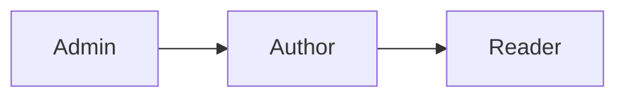
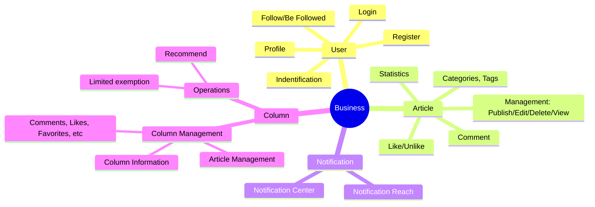
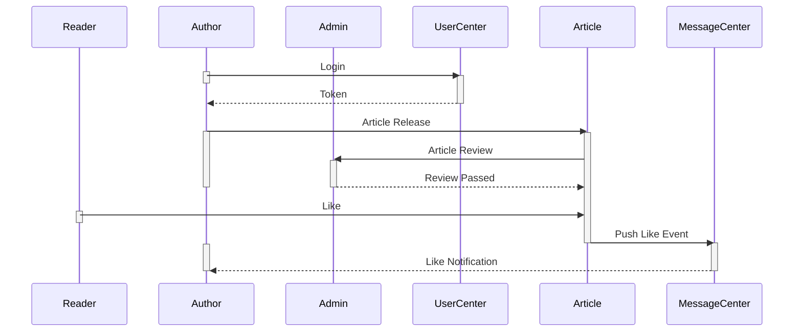

# Thiết kế kiến trúc kĩ thuật

> Bắt đầu trình bày, phân tích để thiết kế kiến trúc tổng thể của dự án

## Business Module

### Phân tích user

Là một hệ thống cộng đồng nên vai trò của người dùng (user) được phân chia thành:

- Reader (độc giả): Người dùng bình thường, đọc bài viết
- Author (Tác giả): Người dùng đăng bài viết
- Admin: Người quản lý toàn bộ hệ thống

#### Phân quyền (Authorization)

Vai trò thẩm quyền được chia thành:

Vấn đề này rất đơn giản:

- Author có tất cả quyền như Reader nhưng có thêm các quyền về biên tập, chỉnh sửa, xuất bản bài viết.
- Admin có quyền hạn cao nhất, bao gồm tất cả quyền của Reader, Author.

#### Sự khác biệt

Vai trò chính của ba kiểu người dùng:

- Reader: chủ yếu đọc bài viết
- Author: Xuất bản, chỉnh sửa bài viết
- Admin: Quản lý toàn bộ hoạt động của hệ thống như nhãn (tag), danh mục (category), bình luận (comment), … và tham gia kiểm duyệt bài viết

Theo phân tích trên, chúng ta phân chia người dùng kĩ thuật thành:

- User: Người dùng thường với tư cách là người đăng kí của cộng đồng.
- Admin: Quản trị viên chịu trách nhiệm về hoạt động của cộng đồng.

### Business Module

Hệ thống cộng đồng được chia thành các phần cơ bản sau theo nghiệp vụ (businesss):

- User
- Article
- Comment
- Column
- Notification

Chúng ta sẽ phân tích chi tiết hơn:

Sau khi phân chia đơn giản như trên, tôi sẽ giải thích một số điểm chính:

- Column: thực chất nó là một tập hợp các bài viết nên các chức năng của nó liên quan trực tiếp tới bài viết.
- Comment: bình luận về bài viết, nó liên quan chặt chẽ với bài viết
- Notification:
	- Kích hoạt thông báo cần được làm rõ thêm, nhưng bản thân nó là một chủ đề trong nghiệp vụ tương đối độc lậo nên cần được tách biệt, trọng tâm là phương thức tương tác với thông báo.
	- Những loại thông báo nào cần được gửi? Làm sao để tạo thông báo?
	- Làm thế nào để thông báo cho người dùng?
- Likes, Favorites, Statistics:
	- Điều này liên quan đến nghiệp vụ nhưng có thể tồn tại độc lập với nghiệp vụ, bạn có thể xem xét xây dựng dịch vụ chung.

Các thành phần độc lập với chức năng nghiệp vụ cốt lõi:

- Tìm kiếm và đề xuất không ảnh hưởng đến chức năng nghiệp vụ cốt lõi nhưng chúng có cần được xem xét thêm?
- Hoạt động của cộng đồng.

Dựa vào những điều trên, tôi chia các business module (module nghiệp vụ) thành các phần sau:

### Tóm tắt

**Vai trò**

- User: Người dùng đăng ký của cộng đồng, họ mở rộgncasc điểm chức năng nghiệp vụ mà họ đề cập đến trong nội dung chính của bài viết.
- Admin: Quản trị viên chịu trách nhiệm quản lý hoạt động của cộng đồng.  
**Business Module**
- Business:
	- Article
	- Comment
	- Column
	- User
	- Operations
- Tính năng cơ bản:
	- Recommend
	- Search
	- Statistics
	- Notification

## Sơ đồ tương tác module

Tiếp theo, tôi trình bày cách hệ thống hoạt động, các module kết nối và tương tác như thế nào!

### Thiết kế tương tác tổng quát

Hoạt động chính của cộng đồng là tác giả xuất bản bài viết và độc giả đọc bài viết. Nghe có vẻ sự tương tác tương đối rõ ràng và đơn giản nên tôi sẽ bỏ qua phần này. Tôi sẽ trình bày quá trình xuất bản bài viết, sau đó độc giả có thể đọc và like bài viết cho tới khi tác giả nhận được thông báo. Vui lòng xem sơ đồ sau, nó không đơn giản như bạn nghĩ:

Trong quá trình tương tác trên, UserCenter, Article, MessageCenter có thể là các dịch vụ hoặc dịch vụ được triển khai độc lập trong một tiến trình, nhưng về mặt logic, chúng độc lập với nhau. Đối với quy trình trên có một số điểm sau:

- Người dùng (Author/Reader) đăng nhập lần đầu vào hệ thống thông qua trung tâm người dùng (UserCenter)
	- Phương thức đăng nhập có thể là tên người dùng, mật khẩu truyền thống, hoặc thông tin đăng nhập OAuth2 của bên thứ ba
	- Sau khi đăng nhập, nhận dạng danh tính của người dùng có thể thông qua cookie/session độc lập, distributed session, jwt, …
- Phát hành bài viết
	- Chuyển tiếp logic đăng bài viết cho tác giả (Author)
	- Đối với tác giả, review bài viết là bị động, tức là có mối quan hệ phụ thuộc là review tự động hay review thủ công? Làm cách nào để thông báo cho Admin review thủ công?
- Thông báo
	- Sau khi người đọc ấn like một bài viết, làm sao để thông báo cho tác giả về lượt thích?
	- Sự kiện tương tự này nên được kích hoạt tới tác giả một cách đồng bộ hay bất đồng bộ?

### Giải pháp thông báo tin nhắn

Tin nhắn thông báo sủ dụng trình điều khiên bất đồng bộ và triển khai tách tời thông qua phương pháp Event/Listener

## Giải pháp kiến trúc tổng quát

Đây chỉ mới là giai đoạn đầu của dự án, còn ít tập trung vào chi tiết mà hãy nhìn rộng ra để có cái nhìn tổng quát.

### Thiết kế sơ khai đầu tiên

Đây là thiết kế sơ khai còn nhiều thiếu sót nhưng nó thể hiện tương đối rõ ý tưởng, sẽ cải thiện dần trong quá trình phát triển.

### Sơ đồ kiến trúc nghiệp vụ

Sơ đồ kiến trúc kĩ thuật đầy đủ:

Comming soon!
