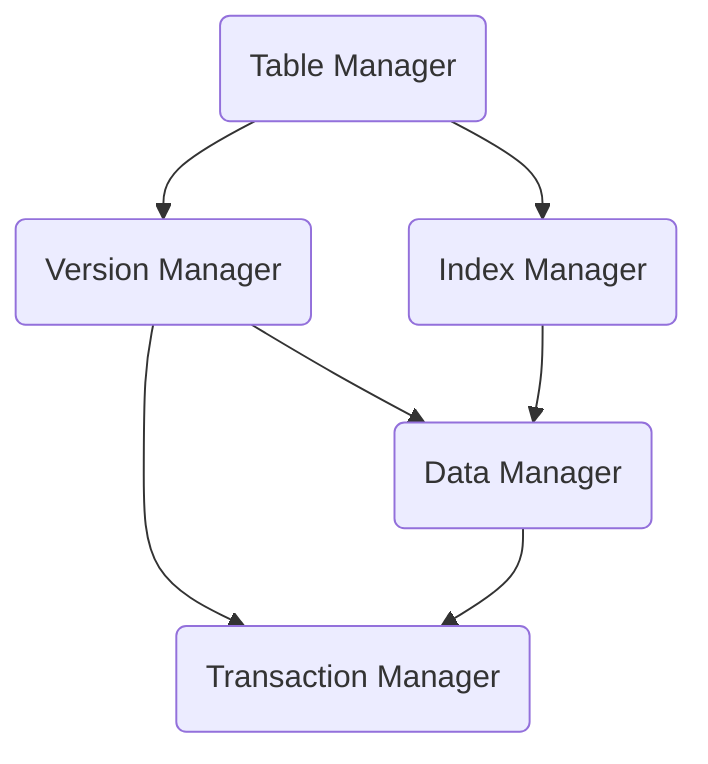

# Kiến trúc và chạy dự án MiniDB

## Giới thiệu

MiniDB là một cơ sở dữ liệu đơn giản được viết bằng Java, một phần được lấy cảm hứng từ MySQL, PostgreSQL và SQLite.  

Các chức năng của dự án như sau:

1. Tính bền vững (durable) và khôi phục dữ liệu.
2. Triển khai giao thức 2PL (Two-Phase Locking) để đảm bảo lập lịch có thể tuần tự hóa (serialization).
3. MVCC (Multi-Version Concurrency Control).
4. Hai cấp độ cô lập (isolation level) giao dịch: Read Committed và Repeatable Read.
5. Xử lý Deadlock.
6. Quản lý bảng và trường đơn giản.
7. Phân tích SQL đơn giản (do không muốn viết cú pháp và máy tự động, nên phân tích khá đơn giản).
8. Dựa trên socket để tạo server và client.

Bạn có thể tham khảo mã nguồn ở đây: [vanhung4499/MiniDB · GitHub](https://github.com/vanhung4499/MiniDB)

## Kiến trúc dự án

MiniDB được chia thành frontend và backend, tương tác thông qua socket.

Giao diện người dùng (client) có một trách nhiệm duy nhất, đọc đầu vào của người dùng, gửi nó đến backend để thực thi, xuất kết quả trả về và chờ đầu vào tiếp theo.

Phần backend MiniDB cần phân tích cú pháp SQL. Nếu đó là SQL hợp lệ, nó sẽ cố gắng thực thi nó và trả về kết quả. Không bao gồm trình phân tích cú pháp, phần backend được chia thành 5 module. Mỗi module có những trách nhiệm nhất định và cung cấp các phương thức cho các module phụ thuộc của nó thông qua các interface. Các module như sau:

1. Transaction Manager (TM)
2. Data Manager（DM）
3. Version Manager（VM
4. Index Manager (IM)
5. Table Manager（TBM）

Sự phụ thuộc của năm module như sau:



Từ biểu đồ phụ thuộc này, có thể thấy thứ tự triển khai thông qua việc sắp xếp cấu trúc liên kết. Trình tự triển khai của tài liệu này là TM -> DM -> VM -> IM -> TBM.

Trách nhiệm của mỗi module như sau:

1. TM duy trì trạng thái giao dịch bằng cách duy trì các tệp **XID** và cung cấp interface cho các module khác để truy vấn trạng thái của một giao dịch nhất định.
2. DM trực tiếp quản lý các tệp cơ sở dữ liệu và tệp nhật ký. Trách nhiệm chính của DM là:
	1. Quản lý các tệp DB trong phân trang và lưu trữ chúng.
	2. Quản lý các tệp nhật ký để đảm bảo khôi phục dựa trên nhật ký khi xảy ra lỗi.
	3. Các tệp DB trừu tượng được các module lớp trên sử dụng làm DataItems và cung cấp bộ đệm.
3. VM triển khai khả năng tuần tự hóa của trình tự lập lịch dựa trên giao thức khóa hai giai đoạn và triển khai MVCC để loại bỏ việc chặn đọc và ghi. Cả hai mức cô lập đều được triển khai đồng thời.
4. IM triển khai chỉ mục dựa trên cây B+, BTW, hiện chỉ hỗ trợ các trường được lập chỉ mục.
5. TBM thực hiện việc quản lý các trường và bảng. Đồng thời, câu lệnh SQL được phân tích cú pháp và bảng được vận hành theo câu lệnh.

## Môi trường phát triển

Dự án sử dụng các công nghệ.

- Java 11
- Maven
- macOS
- IntellijIDEA

Để có thể chạy, bạn cần đảm bảo môi trường Java + Maven.

## Chạy

Đầu tiên chạy lệnh sau để biên dịch mã nguồn:

```shell
mvn compile
```
