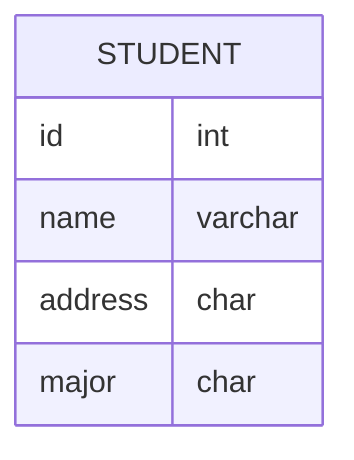

## ERD

ERD (Entity Relationship Diagram) là mô hình thể hiện mối quan hệ giữa các thực thể và thuộc tính thu được từ yêu cầu phân tích.

Đây là một biểu đồ mô tả mối quan hệ với bảng, giúp nhìn thấy cấu trúc cơ sở dữ liệu được sử dụng trong dự án một cách tổng quan.

ERD đóng vai trò như một khung xương khi xây dựng cơ sở dữ liệu và là một phần quan trọng cần chú ý đầu tiên khi xây dựng dịch vụ.

Nó giúp trích xuất API một cách hiệu quả hơn.

### Ứng dụng của ERD

#### Mô hình hóa cơ sở dữ liệu

Thường được sử dụng rộng rãi trong cơ sở dữ liệu quan hệ.

Nó cho phép chuyển đổi các thực thể và thuộc tính thành bảng và cột.

Có thể thấy và phân tích các vấn đề thiết kế thông qua việc hình dung các bảng và mối quan hệ giữa chúng.

#### Kỹ thuật phần mềm

Thường được sử dụng trong giai đoạn lập kế hoạch phần mềm.

Giúp xác định mối quan hệ giữa các thành phần hệ thống khác nhau.

Thường được sử dụng như một cơ sở cho sơ đồ luồng dữ liệu (data flow diagram).

### Sơ đồ ERD

#### Thực thể (Entity)

Thực thể (Entity) đề cập đến các đối tượng hoặc khái niệm có thể được định nghĩa.

Nó có thể bao gồm cả thực thể vật lý, như con người, và thực thể vô hình, như hồ sơ hoặc thông tin sách, có thể được biểu diễn dưới dạng dữ liệu.

Trong cơ sở dữ liệu, các bảng có thể được coi là các thực thể.

Ví dụ, thực thể học sinh được biểu diễn như được hiển thị trong sơ đồ dưới đây.

#### Thuộc tính của thực thể (Entity Attribute)

Thuộc tính của thực thể bao gồm các thuộc tính mà một thực thể có.

Ví dụ, trong thực thể "Student", có các thuộc tính như Mã học sinh, Tên, Địa chỉ, Chuyên ngành, v.v.

Trong cơ sở dữ liệu, mỗi trường (cột) trong bảng có thể được coi là một thuộc tính của thực thể.

#### Domain của thực thể (Entity Domain)

Là cách biểu thị phạm vi giá trị, loại dữ liệu và ràng buộc của một thuộc tính.

Nó có thể được biểu diễn bằng cách chỉ định kiểu dữ liệu của thuộc tính và các ràng buộc liên quan.

Tùy thuộc vào sở thích của người dùng, có thể chỉ hiển thị kiểu dữ liệu của thuộc tính hoặc có thể bỏ qua để tăng tính dễ đọc.

Khi chỉ định kiểu dữ liệu, cần viết theo kiểu dữ liệu được hỗ trợ bởi cơ sở dữ liệu.

Dưới đây là ví dụ về một thực thể học sinh biểu diễn ERD

### Phân loại thực thể

Thực thể (Entity) được phân loại thành các loại khác nhau dựa trên chủ đề thông tin dữ liệu được lưu trữ.

Có thực thể đại diện cho thông tin có hình thức vật lý như thông tin khách hàng, và cũng có thực thể đại diện cho thông tin vô hình và khái niệm như lịch sử mua hàng.

| Phân loại    | Chi tiết    |
| --- | --- |
|Thực thể Hữu hình (Type Entities)| Đại diện cho thông tin có hình thức vật lý (ví dụ: Khách hàng, Sản phẩm, Đối tác, Sinh viên, Giảng viên, v.v.).|
|Thực thể Vô hình (Conceptual Entities)| Đại diện cho thông tin không có hình thức vật lý mà chỉ tồn tại trong khái niệm (ví dụ: Giỏ hàng trực tuyến, Tổ chức phòng ban, v.v.)|
|Thực thể Tài liệu (Document Entities)|Đại diện cho các tài liệu, sổ sách, chứng từ được sử dụng trong quy trình kinh doanh (ví dụ: Hóa đơn, Đơn đặt hàng, v.v.)|
|Thực thể Lịch sử (History Entities)| Đại diện cho thông tin về các hoạt động hoặc sự kiện được lặp lại trong quy trình kinh doanh, được lưu trữ theo ngày hoặc thời gian (ví dụ: Lịch sử nhập kho, Lịch sử xuất kho, Lịch sử mua hàng, v.v.)|
|Thực thể Mã (Code Entities)|Là một loại thực thể vô hình, được sử dụng để quản lý các mã phân loại khác nhau (ví dụ: Mã quốc gia, Mã phân loại đa dạng, v.v.)|

Các loại thực thể này giúp phân loại và tổ chức dữ liệu trong ERD theo các khía cạnh khác nhau của hệ thống hoặc quy trình kinh doanh.

### Ký hiệu mối quan hệ thực thể ERD

|Hạng mục|Mối quan hệ Định danh|Mối quan hệ Không định danh|
|---|---|---|
|Mục đích|Biểu thị mối quan hệ kết nối mạnh|Mối quan hệ kết nối yếu|
|Ảnh hưởng của Định danh con|Bao gồm trong cấu trúc định danh con|Bao gồm trong các thuộc tính không định danh con|
|Biểu diễn|Biểu thị bằng đường thẳng liền|Biểu thị bằng đường thẳng chấm|
|Yếu tố cần xem xét|Thực thể cha phụ thuộc vào, cấu trúc định danh con yêu cầu bao gồm định danh cha, các thuộc tính định danh được kế thừa cần được chuyển đến các thực thể khác|Mối quan hệ phụ thuộc yếu, cấu trúc định danh con được cấu hình độc lập, cấu trúc định danh con yêu cầu phân biệt định danh cha, các thuộc tính định danh được kế thừa cần được chặn khỏi các thực thể khác, sự tham gia của thực thể cha trong mối quan hệ là tùy chọn|

#### Mối quan hệ định danh (Identifier Relationship)

Được biểu thị bằng đường thẳng liền

Trong mối quan hệ cha con, con tham chiếu khóa chính (PK) của cha như một khóa ngoại (FK) và sử dụng nó làm khóa chính của chính mình.

#### Mối quan hệ không định danh (Non-identifier Relationship)

Được biểu thị bằng đường thẳng đứt.

Trong mối quan hệ cha con, con sử dụng khóa chính của cha như một khóa ngoại và tham chiếu nó như một thuộc tính thông thường.

### ERD Notation

#### 1. One

- Mối quan hệ một-một hoặc một-nhiều
- Thường liên quan đến một khóa ngoại duy nhất

#### 2. Many

- Mối quan hệ nhiều-nhiều
- Sử dụng bảng trung gian để liên kết nhiều dữ liệu

#### 3. One (and only One)

- Mối quan hệ một-một, nhưng chỉ có một hàng duy nhất được kết nối

#### 4. Zero or one

- Mối quan hệ một-một hoặc một-nhiều, nhưng không bắt buộc

#### 5. One or Many

- Mối quan hệ một-một hoặc nhiều-nhiều
- Mối quan hệ không rõ ràng với các giá trị hàng tham chiếu

#### 6. Zero or Many

- Mối quan hệ không rõ ràng với bảng tham chiếu
- Có thể không có giá trị hàng, một giá trị hàng hoặc nhiều giá trị hàng

### Gắn kết mối quan hệ ERD

Có thể dùng các biểu tượng sau để chỉ dẫn tại mỗi đầu của mối quan hệ:

- `|` Biểu thị một thực thể bắt buộc phải tồn tại.
- `O` Biểu thị một thực thể có thể không tồn tại.

### Bản chất mối quan hệ ERD

> Cardinality định nghĩa số lượng lần xuất hiện có thể xảy ra cho một thực thể và liên quan đến số lượng lần xuất hiện có thể xảy ra cho thực thể khác.

Các loại cardinality phổ biến bao gồm:

1. 1 - 1 (One to One)
2. 1 - N (One to Many)
3. N - 1 (Many to One)
4. N - N (Many to Many)

Trong ERD, để tăng tính đọc hiểu, thay vì vẽ đường thẳng, ta sử dụng các biểu tượng khác nhau ở hai đầu của mối quan hệ.

#### One-to-One Cardinality

User và User Profile được ánh xạ theo 1:1.

Mỗi người dùng chỉ có một hồ sơ duy nhất và ngược lại mỗi hồ sơ chỉ thuộc về một người dùng

#### One-to-Many Cardinality

Mỗi khoa có nhiều sinh viên theo học

#### Many-to-Many Cardinality

Một sinh viên có thể tham gia nhiều khoá học.  
Một khoá học cũng ssex được nhiều sinh viên đăng kí.  
Đây là một mối quan hệ N-N giữa sinh viên và khoá học.

Tuy nhiên, trong mô hình hóa dữ liệu, nếu coi mối quan hệ N:N (Many-to-Many) là một mô hình không hoàn chỉnh và cần đặt một thực thể trung gian (intermediate entity) điều chỉnh mối quan hệ giữa hai thực thể là 1:N và N:1.

## Normalization

Thực hiện quá trình chuẩn hóa (normalization) có nghĩa là loại bỏ các hiện tượng không mong muốn trong dữ liệu bằng cách tạo ra sự phụ thuộc hàm giữa các yếu tố quyết định và các thuộc tính phụ thuộc, đảm bảo rằng dữ liệu được xác định bởi các yếu tố quyết định. Mục tiêu là loại bỏ các hiện tượng không mong muốn khi thực hiện thao tác nhập, cập nhật và xóa dữ liệu.

Chuẩn hóa cũng giúp giảm thiểu sự trùng lặp dữ liệu bằng cách tập trung chúng vào một bảng duy nhất dựa trên sự phụ thuộc hàm, từ đó giảm thiểu dung lượng lưu trữ dữ liệu của một bảng.

Các bảng đã được chuẩn hóa có thể có các đặc điểm hiệu suất khác nhau khi xử lý dữ liệu, có thể dẫn đến tốc độ xử lý nhanh hơn hoặc chậm hơn.

> Phụ thuộc hàm (Functional Dependency - FD): Khi giá trị của một cột A trong bảng được biết, ta có thể biết được giá trị của một cột B khác, thì ta nói rằng cột B có phụ thuộc hàm vào cột A.

> Nguyên tắc (Determinant): Trong mô tả phụ thuộc hàm, cột A được gọi là nguyên tắc.

> Phụ thuộc đa giá trị (MultiValued Dependency - MVD): Khi dựa vào cột nguyên tắc A, ta có thể biết được nhiều giá trị của cột B, ta nói rằng cột B có phụ thuộc đa giá trị vào cột A.

Mô hình dữ liệu đã được chuẩn hóa có thể cải thiện hoặc làm giảm hiệu suất tùy thuộc vào điều kiện xử lý truy vấn.

Mô hình dữ liệu đã được chuẩn hóa sẽ luôn cải thiện hiệu suất khi thực hiện thao tác nhập, cập nhật và xóa dữ liệu.

### Phụ thuộc hàm

Ký hiệu A->B biểu thị rằng A xác định B, hoặc có thể nói rằng B phụ thuộc vào A.  

Nếu {A1, A2, …, An} là một tập hợp các thuộc tính của một mối quan hệ, và tập hợp này xác định tất cả các thuộc tính khác của mối quan hệ và là tối thiểu, thì nó được gọi là khóa ứng viên.  

Đối với A->B, nếu chúng ta có thể tìm thấy một tập con thích hợp A' của A sao cho A'->B, thì A->B là một phụ thuộc hàm một phần. Ngược lại, nó là một phụ thuộc hàm đầy đủ.

Đối với A->B và B->C, A->C là một phụ thuộc hàm bắc cầu.

### Hiệu ứng và lợi ích của normalization

Dựa trên việc phân tách các thành phần dữ liệu có sự phụ thuộc mạnh mẽ, chúng được định nghĩa thành các khái niệm độc lập (thực thể, bảng), điều này tuân thủ nguyên tắc High Cohesion & Loose Coupling và tạo ra sự linh hoạt tối đa.

> High Cohesion & Loose Coupling: Mô-đun (đơn vị chức năng) có độ cohesiveness cao có thể thực hiện một chức năng đơn lẻ mà không cần tương tác nhiều với các mô-đun khác trong toàn bộ chương trình.

### Các dạng chuẩn hoá

- 1NF: Tách các thuộc tính có đa giá trị thành các thuộc tính riêng biệt để đảm bảo tính nguyên tử và đơn giản hóa cấu trúc dữ liệu.
- 2NF: Tách các thuộc tính không phụ thuộc hoàn toàn vào khóa chính thành các bảng riêng biệt để loại bỏ sự phụ thuộc phần.
- 3NF: Tách các thuộc tính phụ thuộc vào các thuộc tính không phải khóa chính để loại bỏ sự phụ thuộc bắc cầu.
- BCNF: Tách các thuộc tính có sự phụ thuộc vào một khóa chính có sự phụ thuộc hàm trong nó.
- 4NF: Tách các thuộc tính có phụ thuộc đa giá trị thành các bảng riêng biệt.
- 5NF: Tách các phụ thuộc kết hợp thành nhiều bảng nếu có nhiều hơn hai phụ thuộc kết hợp.

> NF: Normal Form

#### Ví dụ chuẩn hoá

 Giả sử, một thư viện video chứa một kho dữ liệu của các bộ phim đã từng được thuê. Khi chưa có chuẩn hóa, tất cả các thông tin được lưu trữ trong một bảng duy nhất ở bên dưới.

**Thuộc tính Movies Rented có nhiều giá trị**

#### 1NF

- Tất cả các thuộc tính nên có giá trị duy nhất (nguyên tử).  
- Các thuộc tính có thể có nhiều giá trị nên được tách riêng.

Kết quả thu được:  

#### 2NF

- Cần đáp ứng yêu cầu của 1NF
- Tất cả các cột không phải là khóa chính (PK) phải hoàn toàn phụ thuộc vào khóa chính.
- Bất kỳ cột nào không phụ thuộc vào khóa chính hoặc chỉ phụ thuộc vào một phần của khóa chính phải được tách riêng.

Khá rõ ràng rằng chúng ta không thể là gì hơn để đơn giản hóa dữ liệu theo 2NF trừ khi ta phân tách bảng trên ra.

Trong đó MEMBERSHIP_ID là khoá ngoại (FK)

#### 3NF

- Cần đáp ứng yêu cầu của 2NF
- Không được có sự phụ thuộc giữa các thuộc tính không phải là khóa chính tức là không có sự bắc cầu trong phụ thuộc hàm.

Như trên ví dụ, Full Name thay đổi sẽ khiến Salutation thay đổi, đây là sự bắc cầu. Do đó cần chia bảng thêm lần nữa:

#### BCNF

Ngay cả khi một CSDL đã ở 3rd Normal Form vẫn có thể có những kết quả dị thường nếu nó có nhiều hơn một khóa ứng viên – Candidate Key.

Đôi khi BCNF được biết đến là **3.5 Normal Form**.

#### 4NF

Nếu không có cá thể bảng cơ sở dữ liệu nào chứa hai hoặc nhiều dữ liệu độc lập và nhiều giá trị mô tả thực thể có liên quan, thì nó ở 4th Normal Form.

#### 5NF

Một bảng là 5th Normal Form chỉ khi là 4NF và không thể bị phân tách thành các bảng nhỏ hơn mà không bị mất dữ liệu
