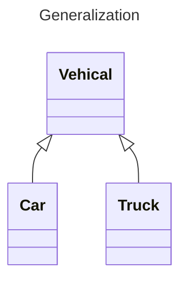
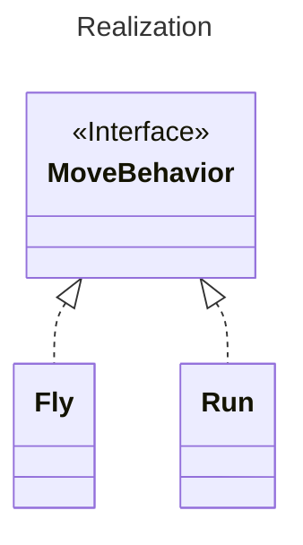
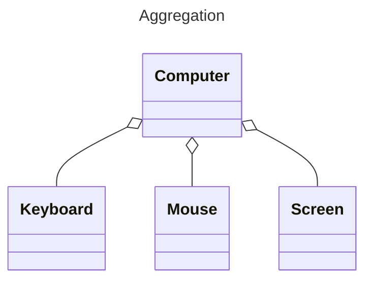
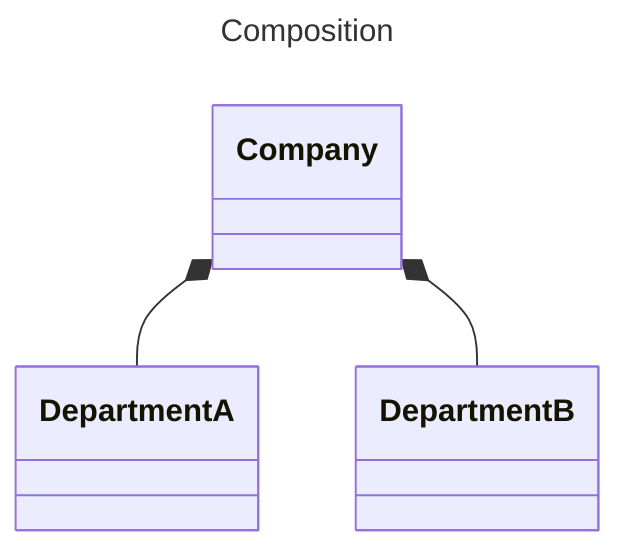
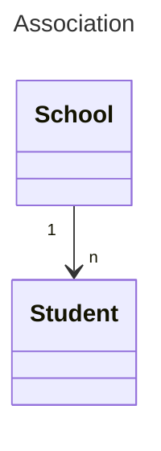
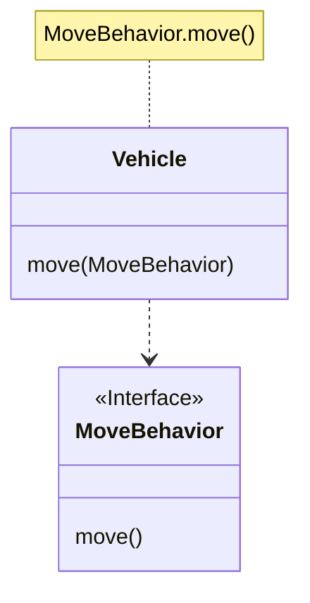

## Ba đặc điểm chính

> [!NOTE]+ Tại sao lại là 3, phải là 4 chứ?  
> Bởi vì tôi xem trừu tượng (abstraction) là một phần trong đóng gói (encapsulation)

### Đóng gói (Encapsulation)

Sử dụng kiểu dữ liệu trừu tượng để đóng gói dữ liệu và các hoạt động dựa trên dữ liệu thành một thực thể độc lập không thể tách rời. Dữ liệu được bảo vệ trong phạm vi của kiểu dữ liệu trừu tượng, ẩn các chi tiết bên trong càng nhiều càng tốt, chỉ giữ lại một số giao diện bên ngoài để liên kết với bên ngoài. Người dùng không cần biết chi tiết bên trong của đối tượng, nhưng có thể truy cập vào đối tượng đó thông qua các giao diện mà đối tượng cung cấp.  

> **Encapsulation  =  Data Hiding + Abstraction.**

Ưu điểm:

- Giảm sự kết nối: Có thể phát triển, kiểm thử, tối ưu hóa, sử dụng, hiểu và sửa đổi độc lập
- Giảm gánh nặng bảo trì: Dễ hiểu hơn cho các lập trình viên và có thể gỡ lỗi mà không ảnh hưởng đến các module khác
- Điều chỉnh hiệu suất hiệu quả: Có thể xác định các module nào ảnh hưởng đến hiệu suất hệ thống Nâng cao khả năng tái sử dụng phần mềm
- Giảm rủi ro xây dựng hệ thống lớn: Ngay cả khi toàn bộ hệ thống không khả dụng, các module độc lập này vẫn có thể khả dụng

Lớp Person dưới đây đóng gói các thuộc tính như tên (name), giới tính (gender), tuổi (age), v.v. Bên ngoài chỉ có thể truy cập vào thuộc tính name và gender của một đối tượng Person thông qua phương thức get(), trong khi không thể truy cập vào thuộc tính age. Tuy nhiên, thuộc tính age có thể được sử dụng bởi phương thức work().

Lưu ý rằng thuộc tính gender được lưu trữ bằng kiểu dữ liệu int, nhưng việc đóng gói giúp người dùng không nhận thấy chi tiết cài đặt này. Và khi cần thay đổi kiểu dữ liệu sử dụng cho thuộc tính gender, cũng có thể thực hiện mà không ảnh hưởng đến mã khách hàng.

```java
public class Person {

    private String name;
    private int gender;
    private int age;

    public String getName() {
        return name;
    }

    public String getGender() {
        return gender == 0 ? "man" : "woman";
    }

    public void work() {
        if (18 <= age && age <= 50) {
            System.out.println(name + " is working very hard!");
        } else {
            System.out.println(name + " can't work any more!");
        }
    }
}
```

## Kế thừa (Inheritance)

Kế thừa thực hiện mối quan hệ **IS-A**, ví dụ như Cat và Animal là một mối quan hệ IS-A, vì vậy Cat có thể kế thừa từ Animal để có được các thuộc tính và phương thức không phải private của Animal.  

Kế thừa nên tuân theo nguyên tắc thay thế Liskov, đối tượng của lớp con phải có thể thay thế cho tất cả các đối tượng của lớp cha.  

Cat có thể được sử dụng như một Animal, có nghĩa là có thể sử dụng tham chiếu Animal để tham chiếu đối tượng Cat. Tham chiếu của lớp cha trỏ đến đối tượng của lớp con được gọi là **upcasting**.

```java
Animal animal = new Cat();
```

### Đa hình (Polymorphism)

Đa hình chia thành đa hình biên dịch và đa hình chạy:

- Đa hình biên dịch chủ yếu ám chỉ việc nạp chồng phương thức (method overloading).
- Đa hình chạy ám chỉ rằng loại cụ thể mà tham chiếu đối tượng được định nghĩa trong chương trình chỉ được xác định trong thời gian chạy.

Đa hình chạy có ba điều kiện:

- Kế thừa
- Ghi đè
- Upcasting

Trong đoạn mã dưới đây, lớp `Instrument` có hai lớp con: `Wind` và `Percussion`, chúng đều ghi đè phương thức `play()` của lớp cha và trong phương thức `main()`, sử dụng tham chiếu của lớp cha `Instrument` để tham chiếu đối tượng `Wind` và `Percussion`. Khi tham chiếu `Instrument` gọi phương thức `play()`, nó sẽ thực thi phương thức `play()` của lớp thực tế mà tham chiếu đối tượng đang trỏ tới, chứ không phải phương thức của lớp `Instrument`.

```java
public class Instrument {
    public void play() {
        System.out.println("Instrument is playing...");
    }
}

public class Wind extends Instrument {
    public void play() {
        System.out.println("Wind is playing...");
    }
}

public class Percussion extends Instrument {
    public void play() {
        System.out.println("Percussion is playing...");
    }
}

public class Music {
    public static void main(String[] args) {
        List<Instrument> instruments = new ArrayList<>();
        instruments.add(new Wind());
        instruments.add(new Percussion());
        for(Instrument instrument : instruments) {
            instrument.play();
        }
    }
}
```

## Sơ đồ lớp

Tôi sử dụng [Mermaid](https://mermaid.js.org/) để vẽ sơ đồ trong toàn bộ tài liệu này!

### Quan hệ tổng quát (Generalization)

Được sử dụng để mô tả mối quan hệ kế thừa, trong Java sử dụng từ khóa extends.



### Quan hệ thực hiện (Realization)



### Quan hệ tổng hợp (Aggregation)

Biểu thị một đối tượng tổng thể được tạo thành từ các phần riêng lẻ, nhưng tổng thể và các phần không phụ thuộc mạnh vào nhau.



### Quan hệ thành phần (Composition)

Khác với tổng hợp, trong đó tổng thể và các phần phụ thuộc mạnh vào nhau. Ví dụ: công ty và các phòng ban, nếu công ty không còn thì các phòng ban cũng không tồn tại.



### Quan hệ kết hợp (Association)

Biểu thị mối quan hệ giữa các đối tượng của các lớp khác nhau. Đây là một mối quan hệ tĩnh, có thể được xác định từ đầu. Có thể sử dụng các mối quan hệ 1-1, many-1, many-many để biểu thị mối quan hệ này. Ví dụ: mối quan hệ giữa học sinh và trường học là một mối quan hệ many-1, một trường học có thể có nhiều học sinh, nhưng một học sinh chỉ thuộc về một trường học.



### Quan hệ phụ thuộc (Dependency)

Khác với mối quan hệ kết hợp, mối quan hệ này có tác dụng trong quá trình chạy. A và B có quan hệ phụ thuộc, có ba hình thức chính:

- A là biến cục bộ trong B
- A là một tham số của phương thức trong B
- A gửi tin nhắn đến B để ảnh hưởng đến B


