# Cơ chế của bộ đếm thời gian

```mermaid
gantt
    title Timer Example
    dateFormat X
    axisFormat %s
    
    section Main
    Mainline JavaScript: 0, 18
    setTimeout(10) begin: milestone, 0, 0
    setInterval(10) begin: milestone, 0, 0
    Mouse Click: milestone, 6, 6
    setTimeout(10) end: milestone, 10, 10
    setInterval(10) end: milestone, 10, 10
    Mouse Click Handler: 18, 28
    Timer Handler: 28, 35
    Interval Handler: 35, 41
    Interval Handler: 50, 55
```



Hãy xem xét những gì đã xảy ra ở đây:

1. Đầu tiên, có một khối mã JavaScript kéo dài 18ms cần được thực thi.
2. Sau đó, có hai bộ đếm thời gian với độ trễ 10ms được đặt, `setTimeout` và `setInterval`, với `setTimeout` được đặt trước.
3. Ở thời điểm 6ms, có một sự kiện nhấp chuột xảy ra.

## Xếp hàng sự kiện

Với nhiều sự kiện xảy ra cùng một lúc, do tính đơn luồng của JavaScript, **khi luồng chính đang thực thi, nếu có sự kiện bất đồng bộ xảy ra, nó sẽ thoát khỏi luồng chính và vào môi trường chủ để xử lý luồng thời gian, sau khi sẵn sàng, nó sẽ được đưa vào hàng đợi sự kiện và chỉ được thực thi khi luồng chính trống**.

Các sự kiện bất đồng bộ ở đây bao gồm: nhấp chuột, kích hoạt định thời, yêu cầu Ajax, Promise và các sự kiện khác.

Trong ví dụ này, trước tiên có một đoạn mã kéo dài 18ms cần thực thi, trong khoảng thời gian 18ms này chỉ có thể thực thi đoạn mã này, **các sự kiện khác xảy ra sẽ chỉ được thêm vào hàng đợi sự kiện đang chờ thực thi**.

Trong khi khối mã đang chạy, tại thời điểm 6ms, sự kiện nhấp chuột xảy ra, và hai xử lý sự kiện `setTimeout` và `setInterval` vào thời điểm 10 mili giây, ba sự kiện này không thể được thực thi ngay lập tức, mà là **được thêm vào hàng đợi sự kiện đang chờ thực thi**.

## Nguyên tắc First-In-First-Out (FIFO)

Tại thời điểm 18ms, khối mã kết thúc thực thi, có ba nhiệm vụ đang xếp hàng chờ thực thi, theo nguyên tắc **First-In-First-Out (FIFO)**, lúc này sẽ thực thi trước sự kiện nhấp chuột, `setTimeout` và `setInterval` sẽ tiếp tục xếp hàng chờ thực thi. Nguyên tắc FIFO có thể hiểu là nhiệm vụ đến trước sẽ được thực thi trước.

## Bỏ qua bộ đếm thời gian

Khi sự kiện nhấp chuột kết thúc thực thi tại thời điểm 28ms, có hai tác vụ (`setTimeout` và `setInterval`) đang chờ thực thi, theo nguyên tắc FIFO, `setTimeout` sẽ được thực thi trước. Tuy nhiên, tại thời điểm 20ms, `setInterval` thứ hai cũng đã đến hạn, vì lúc này sự kiện `click` đã chiếm dụng luồng, nên `setInterval` vẫn không thể thực thi và vì hàng đợi đã có một `setInterval` đang chờ thực thi, lần gọi `setInterval` này sẽ bị bỏ qua.

⚠️ **Lưu ý**: Trình duyệt không cho phép cùng một bộ đếm thời gian được thêm vào hàng đợi thực thi nhiều lần.

## Bộ đếm thời gian không đảm bảo thực thi chính xác đúng thời gian

Sự kiện nhấp chuột kết thúc thực thi tại thời điểm 28ms, có hai nhiệm vụ (`setTimeout` và `setInterval`) đang chờ thực thi, theo nguyên tắc FIFO, `setTimeout` sẽ được thực thi trước.

Vì vậy, chúng ta mong đợi xử lý sự kiện `setTimeout` được đặt vào thời điểm 10ms sẽ bắt đầu thực thi tại thời điểm 28ms, đây chính là lý do tại sao `setTimeout`/`setInterval` không thể đảm bảo thực thi chính xác đúng thời gian.

Tại thời điểm 30ms, `setInterval` lại được kích hoạt, vì trong thời điểm này không có nhiệm vụ nào đang chờ thực thi, nên nó sẽ được thực thi ngay lập tức.

## Bộ đếm thời gian gọi liên tục của bộ đếm thời gian

`setTimeout` kết thúc thực thi, tại thời điểm 36ms, nhiệm vụ `setInterval` trong hàng đợi sẽ bắt đầu thực thi, `setInterval` cần thực thi trong 6ms.

Tại thời điểm 40ms, `setInterval` lại được kích hoạt, vì lúc này không có nhiệm vụ nào đang chờ thực thi, nên nó sẽ được thực thi ngay lập tức.

Tại thời điểm 42ms, **nhiệm vụ `setInterval` đầu tiên kết thúc, sau đó nhiệm vụ `setInterval` trong hàng đợi sẽ ngay lập tức bắt đầu thực thi**, và kết thúc thực thi tại thời điểm 48ms. Sau đó, tại thời điểm 50ms, `setInterval` lại được kích hoạt, vì lúc này không có nhiệm vụ nào đang chờ thực thi, nên nó sẽ được thực thi ngay lập tức.

## Bộ đếm thời gian gọi liên tục của bộ đếm thời gian

Như đã đề cập trước đó, `setInterval` cần thực thi trong khoảng thời gian không dài hơn thời gian chờ đặt, để đảm bảo bộ đếm thời gian được kích hoạt theo chu kỳ.

```js
// Tôi đã thấy nó không chỉ trong Ninja Secrets, mà còn trong rất nhiều nơi khác.
setTimeout(function repeatMe() {
  // làm một cái gì đó
  setTimeout(repeatMe, 10);
  // sau khi hoàn thành nội dung xử lý, gọi lại chương trình này sau 10ms để đảm bảo gọi chu kỳ 10ms
}, 10);
```

- Bộ đếm thời gian không thể kiểm soát thời gian thực thi một cách rất chi tiết, sách đề nghị từ 15ms trở lên.
- Bạn có thể sử dụng bộ đếm thời gian để phân tách các nhiệm vụ chạy trong thời gian dài, bạn có thể tự tìm hiểu thêm trên Google.
